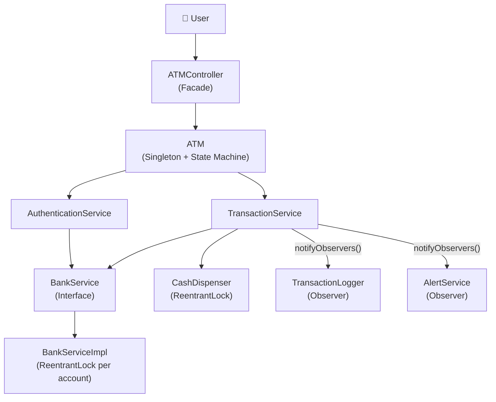
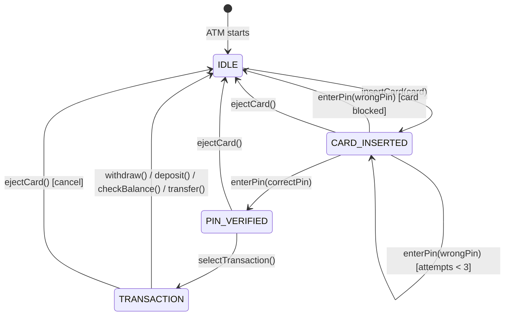
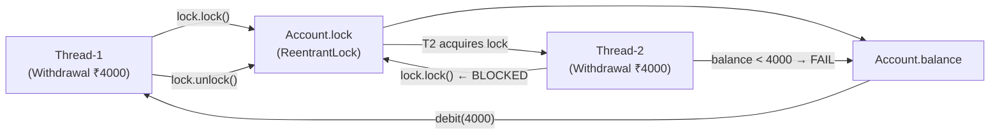

# ATM Machine — Architecture

## Overview

This design implements a **Low-Level Design (LLD)** of an ATM Machine using Java. It applies the **SOLID principles** and the **State, Observer, Singleton, Facade, and Strategy** design patterns. Thread safety is enforced via per-account `ReentrantLock` and a dispenser lock.

---

## Package Structure

```
src/
├── Main.java                          ← Demo entry point
├── enums/
│   ├── ATMState.java                  ← IDLE, CARD_INSERTED, PIN_VERIFIED, TRANSACTION, OUT_OF_SERVICE
│   ├── TransactionType.java           ← WITHDRAW, DEPOSIT, CHECK_BALANCE, TRANSFER
│   └── TransactionStatus.java         ← SUCCESS, FAILED, INSUFFICIENT_FUNDS, INVALID_PIN, CARD_BLOCKED
├── model/
│   ├── Account.java                   ← Account data + ReentrantLock
│   ├── Card.java                      ← Card value object
│   └── Transaction.java               ← Immutable transaction record
├── hardware/
│   └── CashDispenser.java             ← Physical cash management with ReentrantLock
├── state/
│   ├── ATMStateHandler.java           ← State interface (Strategy-like)
│   ├── IdleState.java
│   ├── CardInsertedState.java
│   ├── PinVerifiedState.java
│   └── TransactionState.java
├── service/
│   ├── BankService.java               ← Interface (DIP)
│   ├── BankServiceImpl.java           ← Locking + in-memory account store
│   ├── AuthenticationService.java     ← PIN validation + card blocking
│   └── TransactionService.java        ← Orchestrates transactions + notifies observers
├── observer/
│   ├── ATMObserver.java               ← Observer interface
│   ├── TransactionLogger.java         ← Audit log observer
│   └── AlertService.java             ← Fraud alert observer
└── atm/
    ├── ATM.java                       ← Singleton, state machine orchestrator
    └── ATMController.java            ← Facade API for Main.java
```

---

## High-Level Block Diagram



---

## State Machine Diagram



---

## Locking Strategy



**Transfer Deadlock Prevention:**
Locks are always acquired in lexicographic order of `accountId`, regardless of which is "from" or "to".
This guarantees a consistent lock acquisition order across threads.

---

## Design Patterns Summary

| Pattern | Where Used | Why |
|---|---|---|
| **Singleton** | `ATM.java` | One physical machine = one instance |
| **State** | `IdleState`, `CardInsertedState`, `PinVerifiedState`, `TransactionState` | Clean lifecycle transitions; invalid ops throw immediately |
| **Observer** | `ATMObserver`, `TransactionLogger`, `AlertService` | Decoupled logging & alerting; add new observers without touching ATM core |
| **Facade** | `ATMController` | Hides state machine complexity from `Main.java` |
| **Strategy** | `BankService` interface | Swap bank implementations (mock, real API) without changing ATM |

---

## SOLID Principles

| Principle | Implementation |
|---|---|
| **S**ingle Responsibility | `Account` = data only; `BankServiceImpl` = business logic only; `CashDispenser` = hardware only |
| **O**pen/Closed | Add new observers (`SMSNotifier`) or transaction types without modifying `ATM` or `TransactionService` |
| **L**iskov Substitution | `BankServiceImpl` fully substitutes `BankService`; mock implementations can replace it in tests |
| **I**nterface Segregation | `BankService`, `ATMStateHandler`, `ATMObserver` are narrow, focused interfaces |
| **D**ependency Inversion | `ATM` and `TransactionService` depend on `BankService` interface, not on `BankServiceImpl` |

---

## Concurrency Guarantees

| Scenario | Mechanism | Guarantee |
|---|---|---|
| Two threads withdraw simultaneously | `account.getLock()` (ReentrantLock) | Only one thread debits; second sees updated balance |
| Two transactions dispense cash simultaneously | `dispenserLock` (ReentrantLock) | Atomic check-then-decrement; no double-dispense |
| Transfer A→B vs B→A simultaneously | Lock ordering by `accountId` | No deadlock; one transfer waits for the other |
| Dirty reads on balance | Lock held during read + write in `getBalance`, `withdraw`, `deposit` | Consistent reads |
