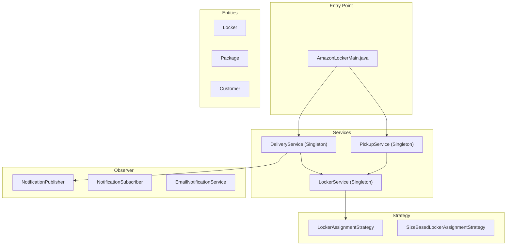
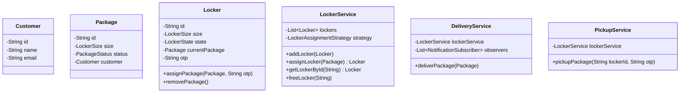
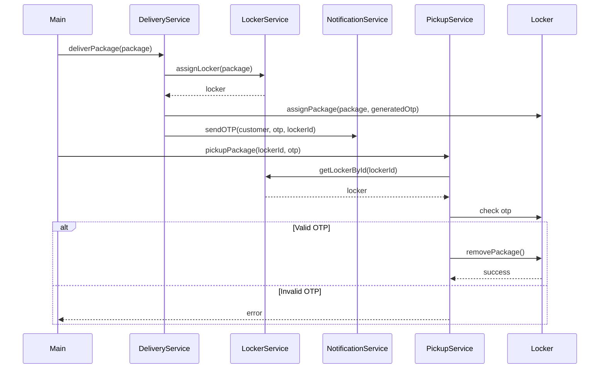

# Amazon Locker System Architecture Documentation

A consistent documentation style for Low-Level Design (LLD) projects using Markdown, Mermaid diagrams, and formatted tables for quick identification of patterns and system components.

## 1. Overview
This is the Low-Level Design (LLD) for the Amazon Locker System. The system manages package deliveries by agents, assigns appropriately sized lockers, and handles customer pickups with OTP validation. It utilizes Java and follows structural and behavioral design patterns: Strategy for locker assignment, Observer for customer notifications, and Singleton for service management.

## 2. Block Diagram (Mermaid)

## 3. Design Patterns Summary Table

| Pattern | Where | Why |
|---------|-------|-----|
| **Observer** | `NotificationPublisher` / `NotificationSubscriber` | Decouples components for automated notifications (e.g., sending OTP via email upon delivery). |
| **Strategy** | `LockerAssignmentStrategy` | Provides interchangeable algorithms for assigning a package to a locker (e.g., size-based matching). |
| **Singleton** | `LockerService`, `DeliveryService`, `PickupService` | Ensures a single source of truth across the application for managing orders and lockers. |

## 4. Class Diagram (Mermaid)

## 5. Flow Diagrams

## 6. Project Structure Table

| Layer | Files |
|-------|-------|
| **Enums** | `LockerSize.java`, `LockerState.java`, `PackageStatus.java` |
| **Entities** | `Locker.java`, `Package.java`, `Customer.java` |
| **Strategy** | `LockerAssignmentStrategy.java`, `SizeBasedLockerAssignmentStrategy.java` |
| **Observer** | `NotificationPublisher.java`, `NotificationSubscriber.java`, `EmailNotificationService.java` |
| **Services** | `LockerService.java`, `DeliveryService.java`, `PickupService.java` |
| **Entry Point** | `AmazonLockerMain.java` |

## 7. Verification Results
- [x] Run `AmazonLockerMain.java` successfully with no compile errors.
