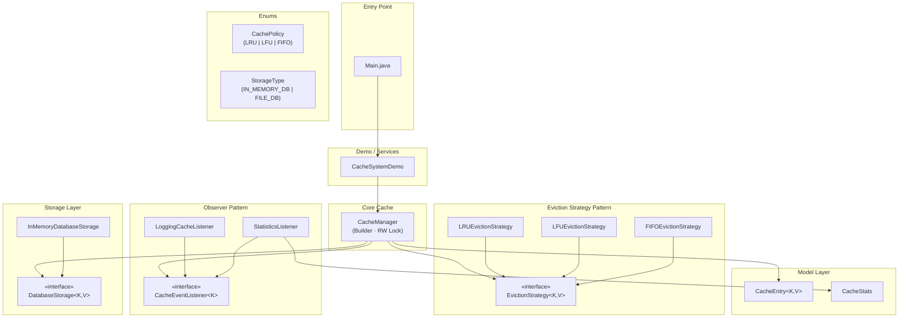
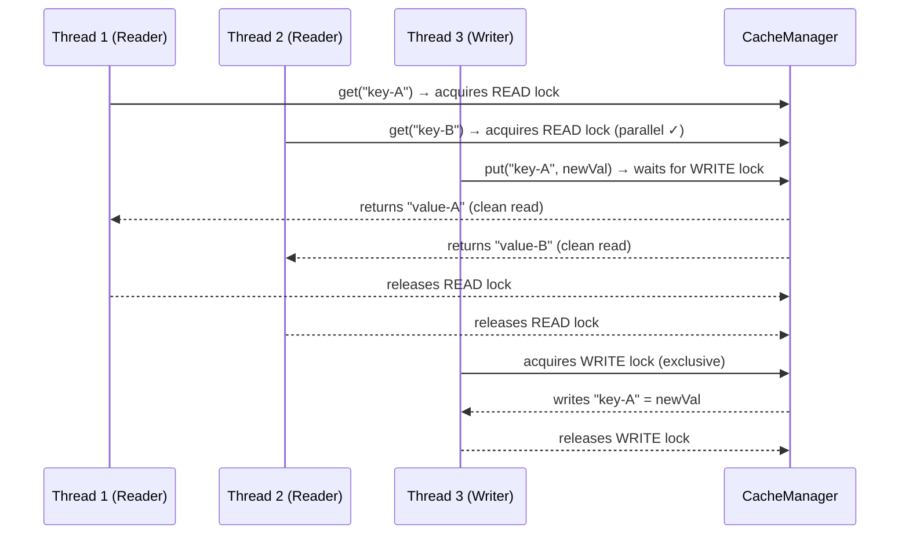
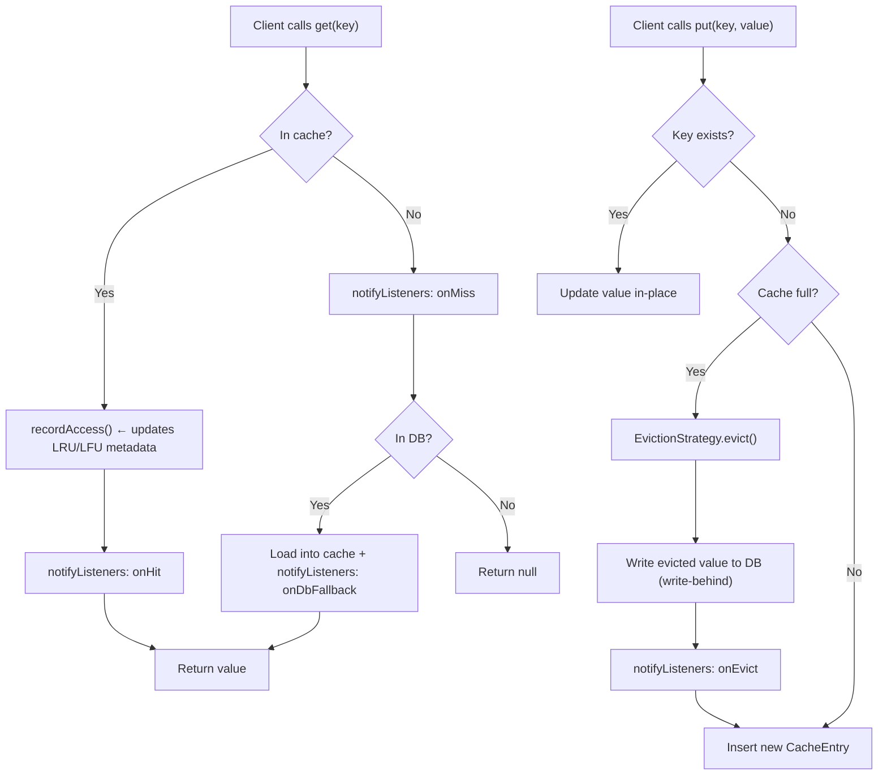
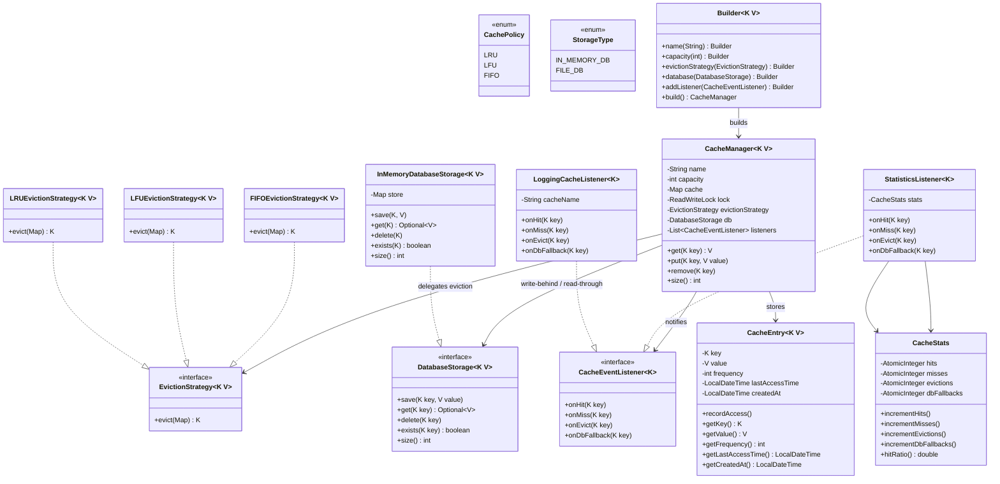

# 🗄️ Cache System — Architecture

## Overview

A Java-based, multi-layered **Cache System** implementing three pluggable eviction policies (LRU, LFU, FIFO), a transparent DB storage fallback, and a `ReentrantReadWriteLock` for safe concurrent access. Designed around four core design patterns: **Strategy**, **Observer**, **Builder (Singleton)**, and **Factory**.

---

## Block Diagram



---

## Design Patterns

| Pattern | Where | Why |
|---------|-------|-----|
| **Strategy** | `EvictionStrategy` → `LRUEvictionStrategy`, `LFUEvictionStrategy`, `FIFOEvictionStrategy` | Swap eviction algorithm at construction time without changing `CacheManager` |
| **Observer** | `CacheEventListener` → `LoggingCacheListener`, `StatisticsListener` | Decouple logging/metrics from cache logic; add new listeners with zero code change |
| **Builder** | `CacheManager.Builder` | Fluent, validated construction; enforces required fields (strategy, DB) |
| **Factory** (implicit) | `Builder.build()` | Centralises `CacheManager` instantiation, hiding constructor |

---

## Concurrency Design — Dirty-Read Prevention



**Rule**: `get()` uses `ReentrantReadWriteLock.readLock()` — N readers run concurrently with no blocking.  
**Rule**: `put()` / `remove()` use `writeLock()` — exclusive access; all readers blocked until write completes.  
**Result**: No thread can ever observe a half-written cache entry (dirty read eliminated).

---

## Cache Read/Write Flow



---

## Class Diagram



---

## Eviction Policy Comparison

| Policy | Evicts | Ideal Workload |
|--------|--------|----------------|
| **LRU** | Entry with oldest `lastAccessTime` | General-purpose; good temporal locality |
| **LFU** | Entry with lowest `frequency` (LRU tie-break) | Workloads with hot-key patterns |
| **FIFO** | Entry with oldest `createdAt` | Streams / time-series where old data is stale |

---

## Project Structure

```
Cache System/
├── src/
│   ├── Main.java                          ← Entry point
│   ├── cache/
│   │   └── CacheManager.java             ← Singleton (Builder), RW Lock, eviction, DB fallback
│   ├── model/
│   │   ├── CacheEntry.java               ← Generic K/V entry with LRU/LFU/FIFO metadata
│   │   └── CacheStats.java               ← Thread-safe hit/miss/eviction counters
│   ├── enums/
│   │   ├── CachePolicy.java              ← LRU | LFU | FIFO
│   │   └── StorageType.java              ← IN_MEMORY_DB | FILE_DB
│   ├── strategy/
│   │   ├── EvictionStrategy.java         ← «interface»
│   │   ├── LRUEvictionStrategy.java
│   │   ├── LFUEvictionStrategy.java
│   │   └── FIFOEvictionStrategy.java
│   ├── observer/
│   │   ├── CacheEventListener.java       ← «interface»
│   │   ├── LoggingCacheListener.java     ← Timestamped console logger
│   │   └── StatisticsListener.java       ← Delegates to CacheStats
│   ├── storage/
│   │   ├── DatabaseStorage.java          ← «interface»
│   │   └── InMemoryDatabaseStorage.java  ← HashMap-backed DB simulation
│   └── services/
│       └── CacheSystemDemo.java          ← End-to-end demo
└── ARCHITECTURE.md                       ← This file
```

---

## Component Responsibilities

| Component | Responsibility |
|-----------|---------------|
| `CacheManager` | Orchestrates all operations; holds the RW lock, strategy, DB, and listeners |
| `CacheEntry<K,V>` | Stores value + access metadata (`frequency`, `lastAccessTime`, `createdAt`) |
| `CacheStats` | Thread-safe counter bag for observability (hit ratio, evictions, DB fallbacks) |
| `EvictionStrategy` | Selects which key to remove when cache is full |
| `LRUEvictionStrategy` | Picks entry with oldest last-access time |
| `LFUEvictionStrategy` | Picks entry with lowest frequency, LRU tie-break |
| `FIFOEvictionStrategy` | Picks entry with earliest creation time |
| `DatabaseStorage` | Interface for the persistent storage backend |
| `InMemoryDatabaseStorage` | HashMap simulation of a real DB |
| `CacheEventListener` | Observer interface for `onHit`, `onMiss`, `onEvict`, `onDbFallback` |
| `LoggingCacheListener` | Prints timestamped event logs |
| `StatisticsListener` | Increments `CacheStats` counters |
| `CacheSystemDemo` | Demonstrates LRU/LFU/FIFO/concurrency/stats in one runnable class |
