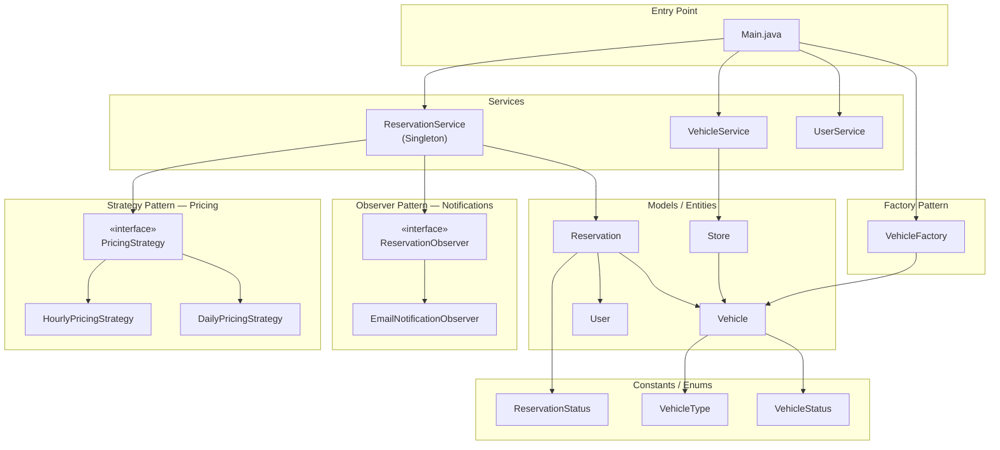
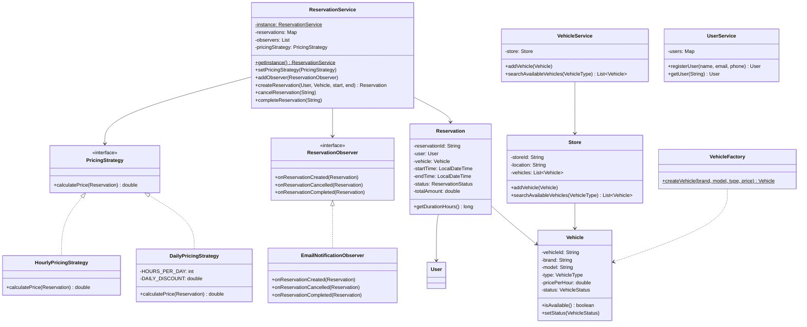
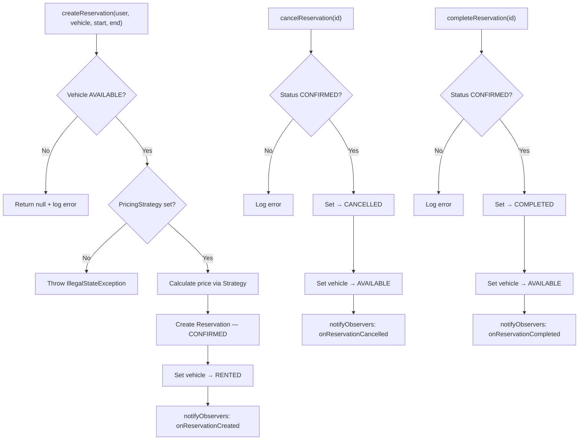

# Car Renting System — Architecture Overview

A Java-based Low-Level Design of a car renting system demonstrating **4 design patterns** — Strategy, Factory, Observer, Singleton — with clean, interview-friendly layered architecture.

---

## Block Diagram

---

## Design Patterns Summary

| Pattern    | Class                                | Purpose                                                          |
|------------|--------------------------------------|------------------------------------------------------------------|
| **Strategy**  | `PricingStrategy` → Hourly / Daily | Swap pricing algorithms at runtime without changing service code |
| **Factory**   | `VehicleFactory`                   | Creates `Vehicle` objects with auto-generated IDs                |
| **Observer**  | `ReservationObserver` → Email      | Sends notifications on booking create / cancel / complete        |
| **Singleton** | `ReservationService`               | One global instance managing all reservations                    |

---

## Class Diagram

---

## Reservation Lifecycle Flow

---

## Project Structure

| Layer      | Package       | Key Files                                                                |
|------------|---------------|--------------------------------------------------------------------------|
| Entry Point| *(default)*   | `Main.java`                                                              |
| Constants  | `constants`   | `VehicleType`, `VehicleStatus`, `ReservationStatus`                      |
| Models     | `models`      | `Vehicle`, `User`, `Reservation`, `Store`                                |
| Strategy   | `strategy`    | `PricingStrategy`, `HourlyPricingStrategy`, `DailyPricingStrategy`       |
| Factory    | `factory`     | `VehicleFactory`                                                         |
| Observer   | `observer`    | `ReservationObserver`, `EmailNotificationObserver`                       |
| Services   | `service`     | `ReservationService` (Singleton), `VehicleService`, `UserService`        |

---

## Verification Results

| Scenario | Result |
|----------|--------|
| Compile 20 files with `javac`                       | ✅ Zero errors |
| Add vehicles via Factory (auto-generated IDs)       | ✅ Working |
| Search available CAR type vehicles                  | ✅ 2 found |
| Create reservation with Hourly pricing (5h × ₹150) | ✅ ₹900 billed |
| Block double-booking of rented vehicle              | ✅ FAILED message shown |
| Cancel reservation → vehicle freed                  | ✅ Email sent, status CANCELLED |
| Swap to Daily pricing at runtime                    | ✅ Strategy pattern works |
| Complete reservation → invoice email               | ✅ Status COMPLETED |
| Vehicle available again after completion            | ✅ Search shows 2 cars |
