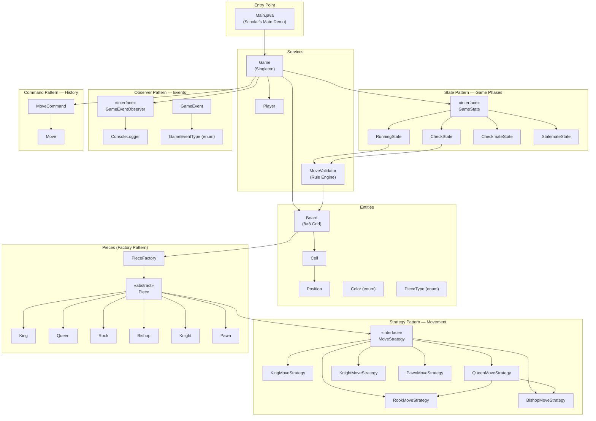
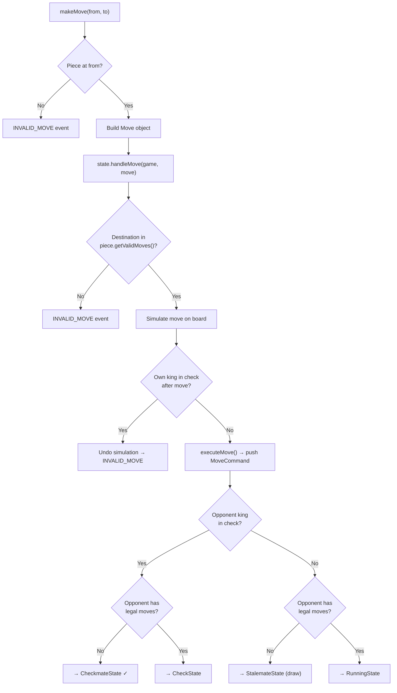

# Chess Game — Architecture Overview

A full Java chess engine demonstrating **5 classical Design Patterns** with complete rule validation, game state management, and move history.

---

## Block Diagram

---

## Design Patterns Summary

| Pattern | Interface/Class | Purpose |
|---------|----------------|---------|
| **Strategy** | `MoveStrategy` → 6 concrete strategies | Pluggable, piece-specific movement rules |
| **Factory** | `PieceFactory` | Creates pieces pre-wired with the correct strategy |
| **State** | `GameState` → Running/Check/Checkmate/Stalemate | Lifecycle transitions, clean state handling |
| **Observer** | `GameEventObserver` → `ConsoleLogger` | Decoupled event notifications (moves, check, etc.) |
| **Command** | `MoveCommand` (execute/undo) | Move history with full undo support |

---

## Class Diagram

```mermaid
classDiagram
    class MoveStrategy {
        <<interface>>
        +getValidMoves(Position, Board, Color) List~Position~
    }
    class KingMoveStrategy { +getValidMoves() List~Position~ }
    class QueenMoveStrategy { +getValidMoves() List~Position~ }
    class RookMoveStrategy  { +getValidMoves() List~Position~ }
    class BishopMoveStrategy{ +getValidMoves() List~Position~ }
    class KnightMoveStrategy{ +getValidMoves() List~Position~ }
    class PawnMoveStrategy  { +getValidMoves() List~Position~ }
    MoveStrategy <|.. KingMoveStrategy
    MoveStrategy <|.. QueenMoveStrategy
    MoveStrategy <|.. RookMoveStrategy
    MoveStrategy <|.. BishopMoveStrategy
    MoveStrategy <|.. KnightMoveStrategy
    MoveStrategy <|.. PawnMoveStrategy
    QueenMoveStrategy --> RookMoveStrategy
    QueenMoveStrategy --> BishopMoveStrategy

    class Piece {
        <<abstract>>
        -Color color
        -PieceType type
        -MoveStrategy moveStrategy
        +getValidMoves(Position, Board) List~Position~
        +setMoveStrategy(MoveStrategy)
    }
    class King   { +King(Color) }
    class Queen  { +Queen(Color) }
    class Rook   { +Rook(Color) }
    class Bishop { +Bishop(Color) }
    class Knight { +Knight(Color) }
    class Pawn   { +Pawn(Color) }
    Piece <|-- King
    Piece <|-- Queen
    Piece <|-- Rook
    Piece <|-- Bishop
    Piece <|-- Knight
    Piece <|-- Pawn
    Piece --> MoveStrategy

    class PieceFactory {
        +createPiece(PieceType, Color) Piece$
    }
    PieceFactory ..> Piece

    class GameState {
        <<interface>>
        +handleMove(Game, Move)
        +getStateName() String
    }
    class RunningState   { +handleMove(Game, Move) }
    class CheckState     { +handleMove(Game, Move) }
    class CheckmateState { -winner: String; +handleMove(Game, Move) }
    class StalemateState { +handleMove(Game, Move) }
    GameState <|.. RunningState
    GameState <|.. CheckState
    GameState <|.. CheckmateState
    GameState <|.. StalemateState

    class GameEventObserver {
        <<interface>>
        +onEvent(GameEvent)
    }
    class ConsoleLogger { +onEvent(GameEvent) }
    GameEventObserver <|.. ConsoleLogger

    class Move {
        -Position from
        -Position to
        -Piece movedPiece
        -Piece capturedPiece
        +isCapture() boolean
    }
    class MoveCommand {
        -Move move
        +execute(Board)
        +undo(Board)
    }
    MoveCommand --> Move

    class Game {
        -Game instance$
        -Board board
        -Player whitePlayer
        -Player blackPlayer
        -Player currentPlayer
        -GameState state
        -Deque~MoveCommand~ moveHistory
        -List~GameEventObserver~ observers
        +getInstance(String,String) Game$
        +makeMove(int,int,int,int)
        +executeMove(Move)
        +undoLastMove()
        +addObserver(GameEventObserver)
        +notifyObservers(GameEvent)
        +switchTurn()
    }
    Game --> Board
    Game --> GameState
    Game --> GameEventObserver
    Game --> MoveCommand

    class MoveValidator {
        +isValidMove(Move, Board, Color) boolean$
        +isInCheck(Color, Board) boolean$
        +hasAnyValidMove(Color, Board) boolean$
    }
    Game --> MoveValidator
```

---

## Move Validation Flow

---

## Project Structure

| Layer | Package | Key Files |
|-------|---------|-----------|
| Entry Point | *(default)* | `Main.java` |
| Entities | `Entities` | `Board`, `Cell`, `Position`, `Color`, `PieceType` |
| Pieces | `Pieces` | `Piece` (abstract), `King`, `Queen`, `Rook`, `Bishop`, `Knight`, `Pawn` |
| Strategy | `Strategy` | `MoveStrategy` (interface), 6 implementations |
| Factory | `Factory` | `PieceFactory` |
| State | `State` | `GameState`, `RunningState`, `CheckState`, `CheckmateState`, `StalemateState` |
| Observer | `Observer` | `GameEventObserver`, `ConsoleLogger`, `GameEvent`, `GameEventType` |
| Command | `Command` | `Move`, `MoveCommand` |
| Services | `Services` | `Game` (Singleton), `MoveValidator`, `Player` |

---

## Verification Results

| Check | Result |
|-------|--------|
| `javac` compilation (35 files) | ✅ Zero errors |
| Pawn opening moves (e2→e4, e7→e5) | ✅ Logged as MOVE_MADE |
| Bishop and Knight development | ✅ Correct diagonal / L-shape moves |
| Queen long-range move (d1→h5) | ✅ Correct |
| Checkmate detection (Scholar's Mate h5×f7) | ✅ CHECKMATE event fired |
| Invalid move after checkmate | ✅ INVALID_MOVE event fired |
| Undo last move (Command pattern) | ✅ Board restored to pre-checkmate state |
