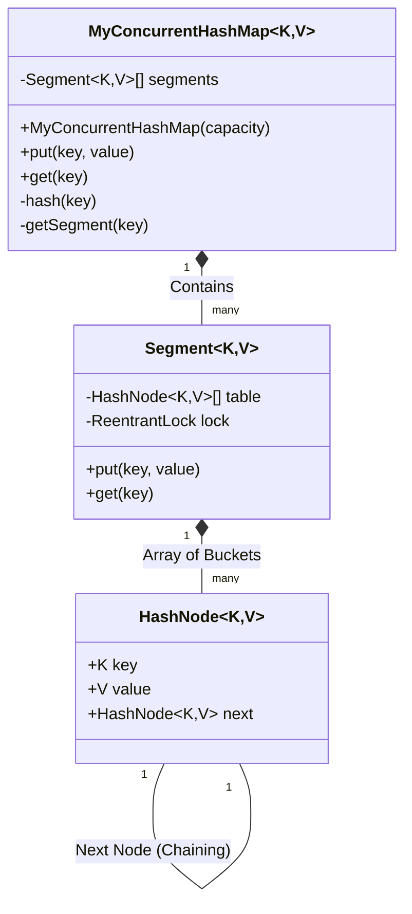

# Concurrent HashMap System Design Architecture

This module implements a Thread-Safe HashMap using the **Lock Stripping** pattern (Segment-based locking). It achieves high concurrency compared to `Collections.synchronizedMap` or `Hashtable` (which lock the entire map structure) by dividing the map into discrete partitions.

## Block Diagram

## How It Works
1. **Segments**: The map is partitioned into an array of `Segment`s physically isolating sections of memory.
2. **Independent Locks**: Each `Segment` acts as an independent HashMap and maintains its own `ReentrantLock`.
3. **High Concurrency**: Multiple threads can write to the map completely concurrently *as long as their keys hash to different segments*. They only block each other on segment collisions.
4. **Collision Resolution**: Within each segment's bucket array, local hash collisions are resolved using standard Linked Lists (Chaining).
