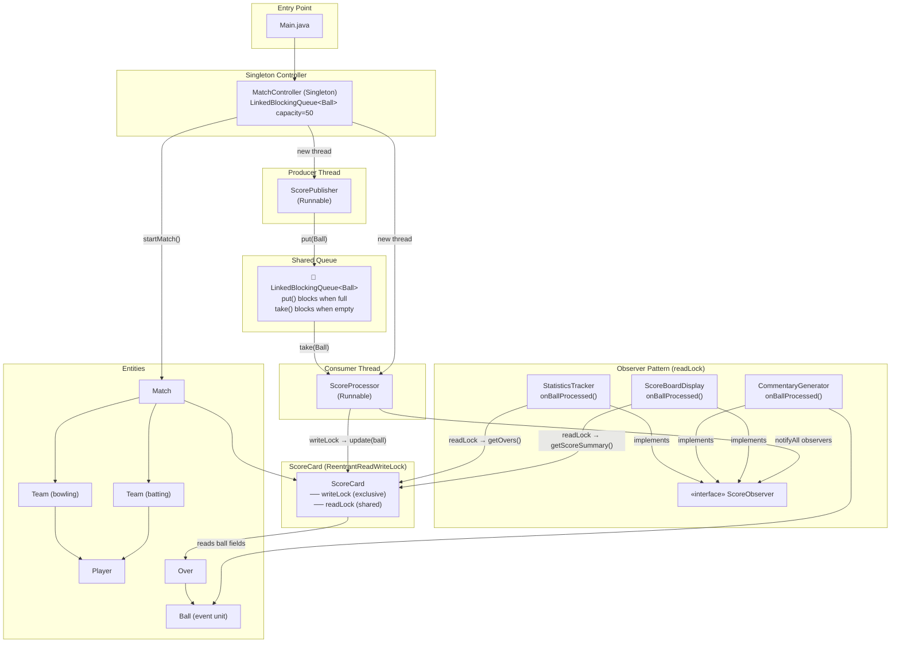
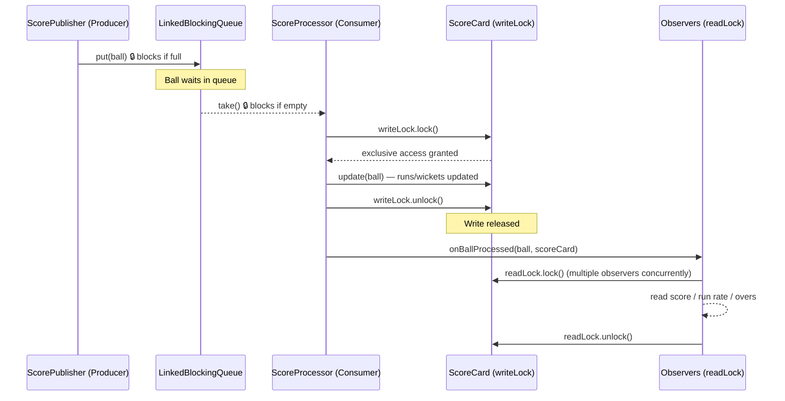
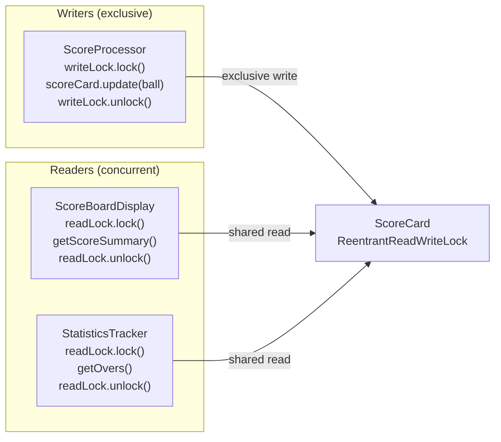
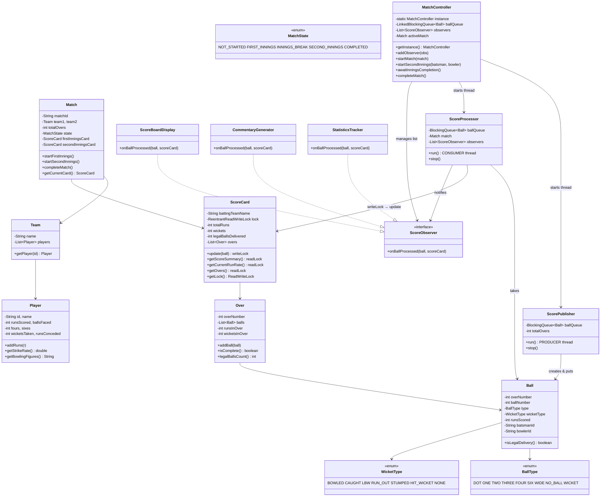
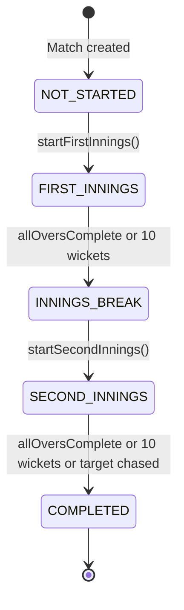

# 🏏 Cricket Score Update System — Architecture

## Overview

A Java-based real-time cricket scoreboard built around a **Producer-Consumer** pipeline protected by a **ReentrantReadWriteLock**. Ball-by-ball events flow from a publisher thread through a `LinkedBlockingQueue` to a processor thread. Multiple observers read the scorecard concurrently under shared read-locks while the processor holds the exclusive write-lock.

---

## Block Diagram



---

## Producer-Consumer + Lock Flow (per delivery)



---

## ReentrantReadWriteLock Usage



> **Rule**: While `writeLock` is held → ALL readers block.  
> While only `readLock`s are held → multiple readers proceed simultaneously.

---

## Class Diagram



---

## Match Lifecycle State Machine



---

## Package Structure

```
src/
├── Main.java
├── Constants/
│   ├── BallType.java         (DOT, ONE, TWO, THREE, FOUR, SIX, WIDE, NO_BALL, WICKET)
│   ├── WicketType.java       (BOWLED, CAUGHT, LBW, RUN_OUT, STUMPED, HIT_WICKET, NONE)
│   └── MatchState.java       (NOT_STARTED → FIRST_INNINGS → INNINGS_BREAK → SECOND_INNINGS → COMPLETED)
├── Entities/
│   ├── Player.java           ← batting + bowling stats (synchronized methods)
│   ├── Team.java             ← squad of players
│   ├── Ball.java             ← atomic event unit flowing through BlockingQueue
│   ├── Over.java             ← 6-legal-ball grouping
│   ├── ScoreCard.java        ← ⭐ ReentrantReadWriteLock (exclusive write / shared read)
│   └── Match.java            ← lifecycle, 2 ScoreCards, result announcement
├── Observer/
│   ├── ScoreObserver.java        ← interface: onBallProcessed(ball, scoreCard)
│   ├── ScoreBoardDisplay.java    ← readLock → live score line
│   ├── CommentaryGenerator.java  ← ball-by-ball commentary text
│   └── StatisticsTracker.java    ← readLock → over-end summary
├── Producer/
│   └── ScorePublisher.java   ← ⭐ PRODUCER — put(Ball) → LinkedBlockingQueue
├── Consumer/
│   └── ScoreProcessor.java   ← ⭐ CONSUMER — take(Ball) → writeLock → update → notify
└── Services/
    └── MatchController.java  ← ⭐ Singleton — owns queue, starts threads, manages lifecycle
```

---

## Component Responsibilities

| Component | Role |
|-----------|------|
| `Ball` | Atomic data unit — flows through the queue |
| `ScoreCard` | Shared mutable state — guarded by `ReentrantReadWriteLock` |
| `ScorePublisher` | **Producer** — generates `Ball` events, calls `queue.put()` |
| `ScoreProcessor` | **Consumer** — calls `queue.take()`, holds `writeLock`, notifies observers |
| `ScoreObserver` (×3) | Read scorecard under `readLock` — multiple run concurrently |
| `MatchController` | **Singleton** — creates the `LinkedBlockingQueue(50)`, starts/joins threads |
| `Match` | Owns innings state and both `ScoreCard`s |
