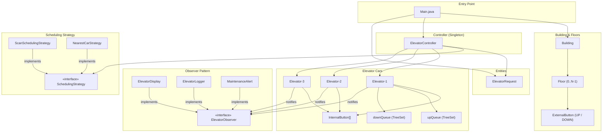
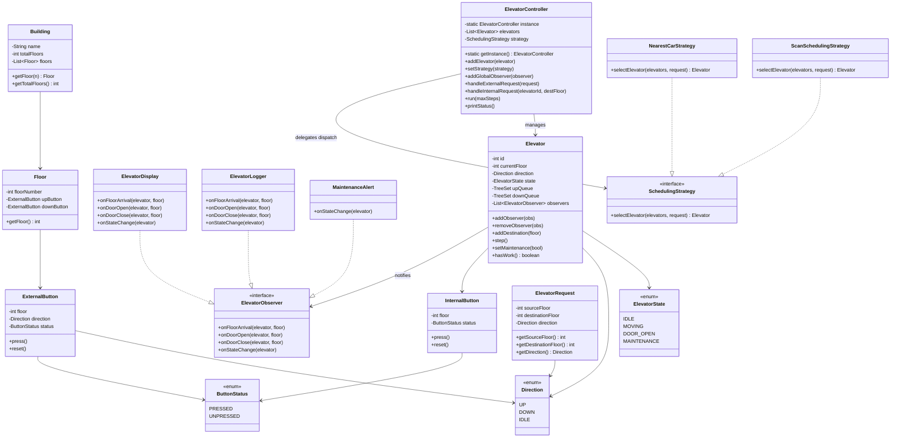
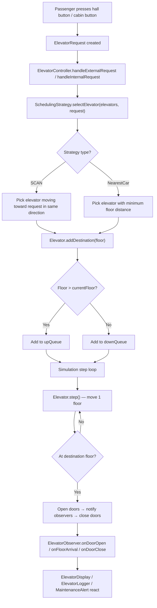
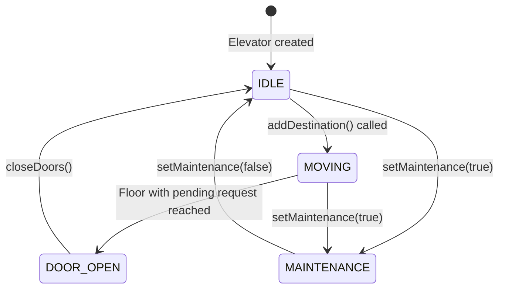

# 🏢 Elevator System — Architecture

## Overview

A Java-based multi-elevator system built using **Observer**, **Strategy**, **State**, and **Singleton** design patterns. Supports multiple elevator cars in a building, pluggable dispatch algorithms (SCAN, NearestCar), real-time observer notifications (display board, audit log, maintenance alerts), and SCAN-queue–based floor scheduling.

---

## Block Diagram



---

## Design Patterns Used

| Pattern | Where | Why |
|---------|-------|-----|
| **Singleton** | `ElevatorController` | One global controller manages all elevators and state |
| **Observer** | `ElevatorObserver` ← `Elevator` | Decouples elevators from display/logging/alert logic |
| **Strategy** | `SchedulingStrategy` → `ScanSchedulingStrategy`, `NearestCarStrategy` | Swap dispatch algorithm at runtime without touching elevator code |
| **State** | `ElevatorState` (IDLE, MOVING, DOOR_OPEN, MAINTENANCE) | Models elevator lifecycle cleanly; prevents invalid transitions |

---

## Class Diagram



---

## Request Flow



---

## State Machine — Elevator Lifecycle



---

## Component Responsibilities

| Component | Package | Responsibility |
|-----------|---------|----------------|
| `Direction` | `Constants` | Enum: UP, DOWN, IDLE |
| `ElevatorState` | `Constants` | Enum: IDLE, MOVING, DOOR_OPEN, MAINTENANCE |
| `ButtonStatus` | `Constants` | Enum: PRESSED, UNPRESSED |
| `ExternalButton` | `Entities` | Hall-call button on each floor per direction |
| `InternalButton` | `Entities` | Cabin panel button for destination floors |
| `Floor` | `Entities` | Models a physical floor; holds ExternalButtons |
| `ElevatorRequest` | `Entities` | Encapsulates a hall call or cabin destination request |
| `ElevatorObserver` | `ElevatorObserver` | Observer interface: floor arrival, door events, state change |
| `ElevatorDisplay` | `ElevatorObserver` | Concrete observer: prints display board messages |
| `ElevatorLogger` | `ElevatorObserver` | Concrete observer: timestamped audit log |
| `MaintenanceAlert` | `ElevatorObserver` | Concrete observer: fires alert on MAINTENANCE state |
| `SchedulingStrategy` | `SchedulingStrategy` | Strategy interface: selects best elevator for a request |
| `ScanSchedulingStrategy` | `SchedulingStrategy` | SCAN algorithm — prefers in-path elevator; minimizes wait |
| `NearestCarStrategy` | `SchedulingStrategy` | Simple minimum-distance selection |
| `Elevator` | `Services` | Single elevator car; SCAN queues, Observer notifications, State |
| `Building` | `Services` | Registry of floors in the building |
| `ElevatorController` | `Services` | **Singleton** — orchestrates all elevators, dispatch, simulation loop |

---

## Package Structure

```
src/
├── Main.java
├── Constants/
│   ├── Direction.java
│   ├── ElevatorState.java
│   └── ButtonStatus.java
├── Entities/
│   ├── ExternalButton.java
│   ├── InternalButton.java
│   ├── Floor.java
│   └── ElevatorRequest.java
├── ElevatorObserver/
│   ├── ElevatorObserver.java      ← interface
│   ├── ElevatorDisplay.java
│   ├── ElevatorLogger.java
│   └── MaintenanceAlert.java
├── SchedulingStrategy/
│   ├── SchedulingStrategy.java    ← interface
│   ├── ScanSchedulingStrategy.java
│   └── NearestCarStrategy.java
└── Services/
    ├── Elevator.java
    ├── Building.java
    └── ElevatorController.java    ← Singleton
```
