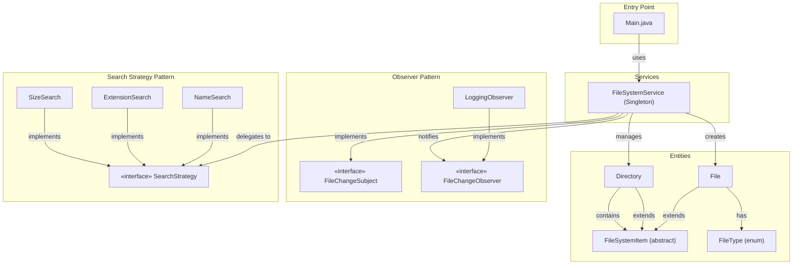
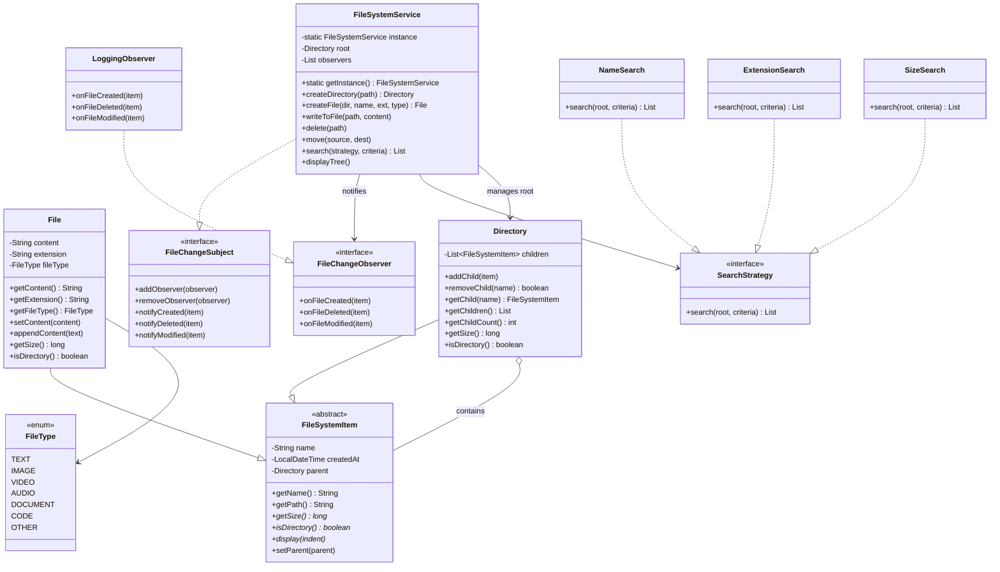
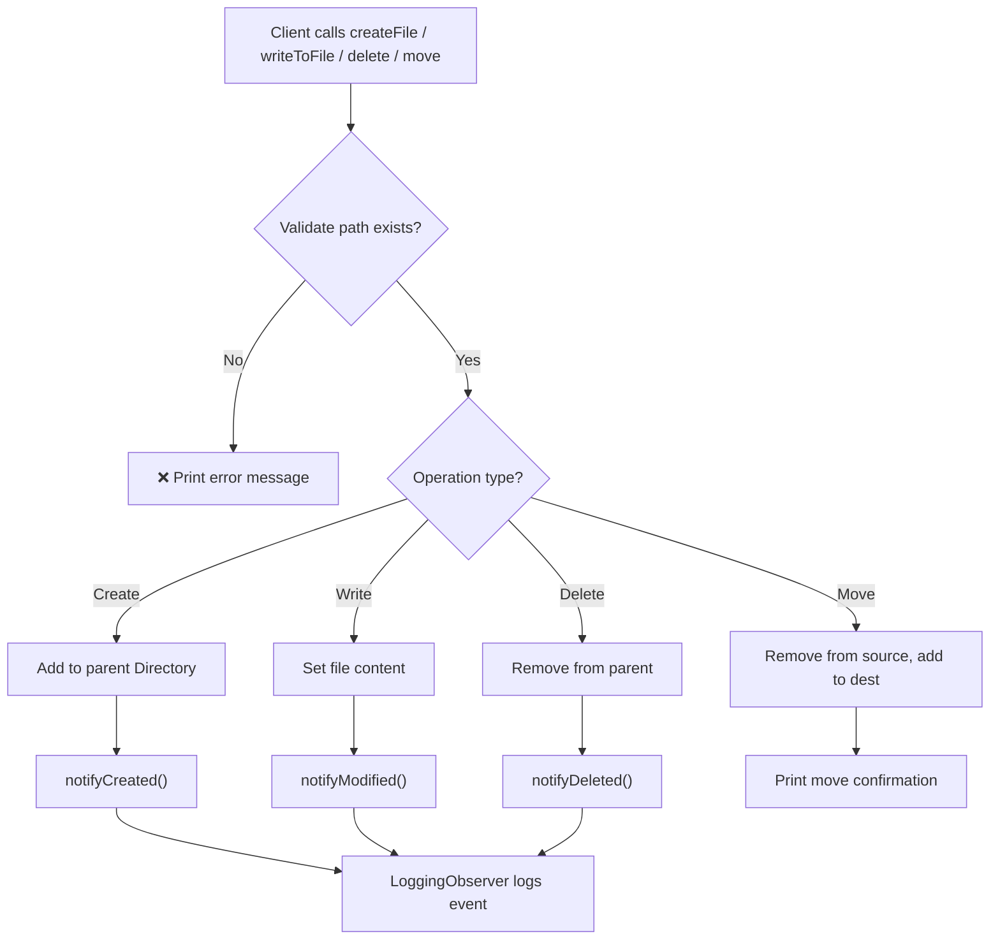
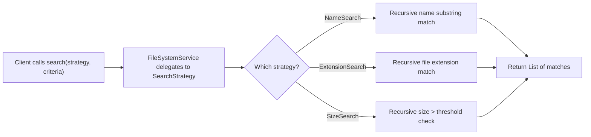

# 📁 File System — Architecture

## Overview

A Java-based File System built using **Composite**, **Observer**, **Strategy**, and **Singleton** design patterns. Supports nested directory creation, file CRUD operations, pluggable search algorithms (by name, extension, or size), file move/delete, and real-time change notifications.

---

## Block Diagram



---

## Design Patterns Used

| Pattern | Where | Why |
|---------|-------|-----|
| **Composite** | `FileSystemItem` → `File`, `Directory` | Unified tree structure — directories recursively contain files and other directories |
| **Observer** | `FileChangeSubject` / `FileChangeObserver` | `LoggingObserver` auto-logs create, delete, and modify events with timestamps |
| **Strategy** | `SearchStrategy` → `NameSearch`, `ExtensionSearch`, `SizeSearch` | Pluggable search algorithms — switch at runtime without modifying client code |
| **Singleton** | `FileSystemService` | Single global file system root ensures data consistency |

---

## Class Diagram



---

## File Operation Flow



---

## Search Strategy Flow



---

## Component Responsibilities

| Component | Responsibility |
|-----------|---------------|
| `FileSystemItem` | Abstract base — provides common `name`, `path`, `size` contract |
| `File` | Leaf node — stores content, extension, type; calculates size from content length |
| `Directory` | Composite node — holds children, recursive size calculation, tree display |
| `FileType` | Categorization enum for files |
| `FileChangeSubject` | Subject interface for observer registration and notifications |
| `FileChangeObserver` | Observer interface for reacting to file events |
| `LoggingObserver` | Concrete observer — logs events with timestamps |
| `SearchStrategy` | Strategy interface for pluggable search algorithms |
| `NameSearch` | Searches by name substring (case-insensitive) |
| `ExtensionSearch` | Searches by file extension |
| `SizeSearch` | Searches for files above a size threshold |
| `FileSystemService` | Singleton — manages root, orchestrates all operations, notifies observers |

---

## Folder Structure

```
File System/
├── architecture.md
└── src/
    ├── Main.java
    ├── entities/
    │   ├── FileSystemItem.java
    │   ├── File.java
    │   ├── Directory.java
    │   └── FileType.java
    ├── Observer/
    │   ├── FileChangeObserver.java
    │   ├── FileChangeSubject.java
    │   └── LoggingObserver.java
    ├── Strategy/
    │   ├── SearchStrategy.java
    │   ├── NameSearch.java
    │   ├── ExtensionSearch.java
    │   └── SizeSearch.java
    └── Services/
        └── FileSystemService.java
```
