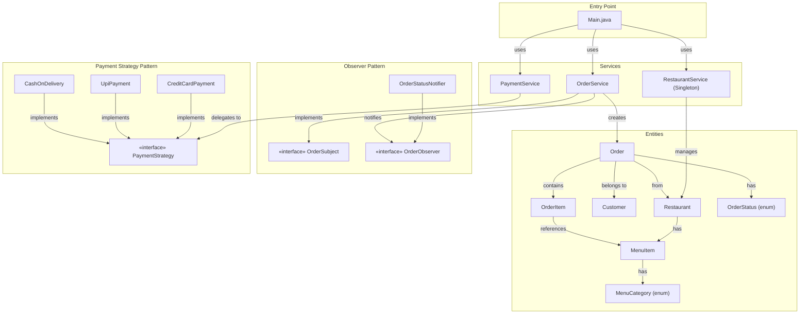
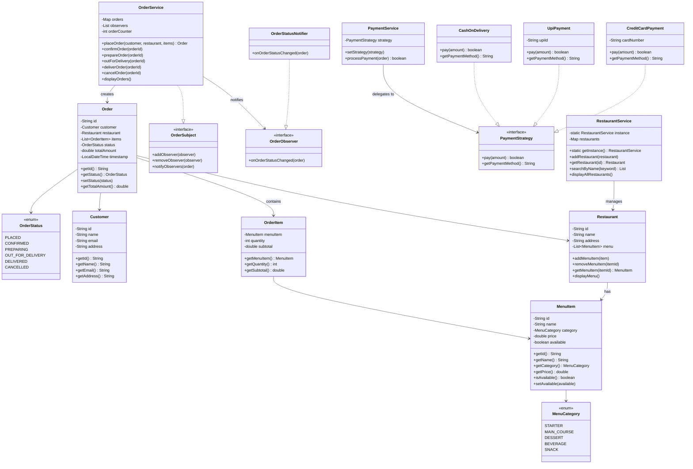
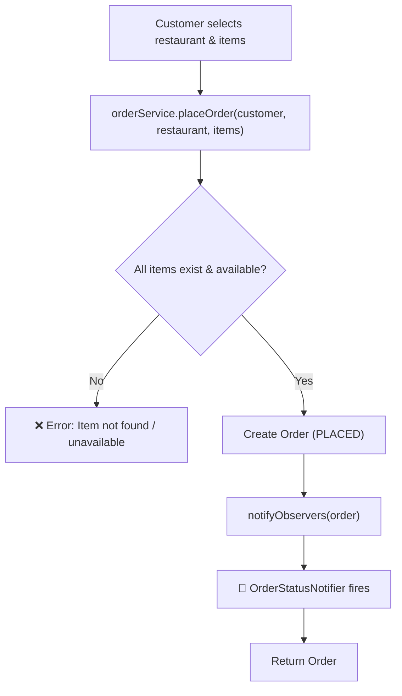
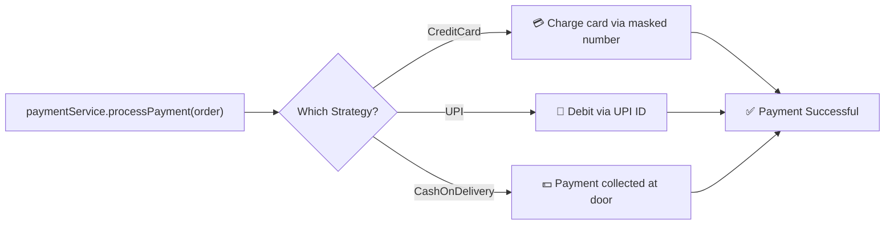
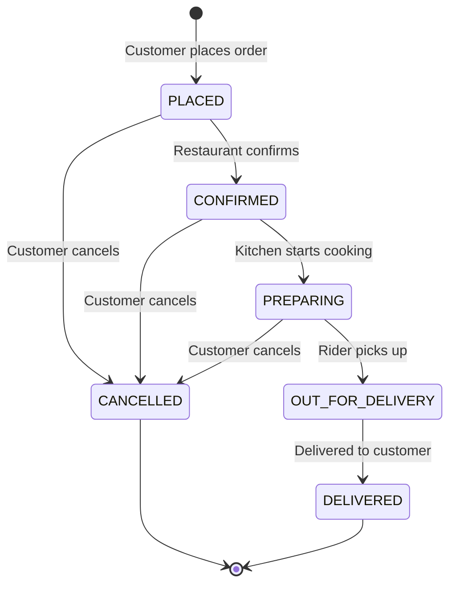

# 🍔 Food Ordering System — Architecture

## Overview

A Java-based Food Ordering System built using **Observer**, **Strategy**, and **Singleton** design patterns. Supports restaurant & menu management, multi-item order placement, pluggable payment methods (Credit Card / UPI / Cash on Delivery), and full order lifecycle with real-time status notifications.

---

## Block Diagram



---

## Design Patterns Used

| Pattern | Where | Why |
|---------|-------|-----|
| **Observer** | `OrderSubject` / `OrderObserver` | `OrderStatusNotifier` auto-notifies customers when order status changes (PLACED → CONFIRMED → PREPARING → DELIVERED) |
| **Strategy** | `PaymentStrategy` → `CreditCardPayment`, `UpiPayment`, `CashOnDelivery` | Pluggable payment methods — switch at runtime without modifying client code |
| **Singleton** | `RestaurantService` | Single global restaurant catalog ensures data consistency |

---

## Class Diagram



---

## Order Flow



---

## Payment Flow



---

## Order Lifecycle



---

## Component Responsibilities

### Entities

| Class | Responsibility |
|-------|---------------|
| `MenuItem` | Food item with id, name, category, price, availability. Equals/hash by id |
| `MenuCategory` | Enum — STARTER, MAIN_COURSE, DESSERT, BEVERAGE, SNACK |
| `Restaurant` | Has id, name, address, menu (list of MenuItems). CRUD on menu items |
| `Customer` | Stores id, name, email, delivery address |
| `OrderItem` | Links MenuItem with quantity, auto-calculates subtotal |
| `Order` | Full order — customer, restaurant, items, status, total, timestamp |
| `OrderStatus` | Enum — PLACED → CONFIRMED → PREPARING → OUT_FOR_DELIVERY → DELIVERED / CANCELLED |

### Observer

| Class | Responsibility |
|-------|---------------|
| `OrderSubject` | Interface — add/remove/notify observers on order status change |
| `OrderObserver` | Interface — `onOrderStatusChanged(order)` callback |
| `OrderStatusNotifier` | Prints notification with emoji when order status changes |

### Strategy (Payment)

| Class | Responsibility |
|-------|---------------|
| `PaymentStrategy` | Interface — `pay(amount)` returns boolean, `getPaymentMethod()` returns name |
| `CreditCardPayment` | Simulates credit card payment — displays masked card number |
| `UpiPayment` | Simulates UPI payment — displays UPI ID |
| `CashOnDelivery` | Cash on delivery — always succeeds |

### Services

| Class | Responsibility |
|-------|---------------|
| `RestaurantService` | Singleton — manages restaurant catalog, search by name, display all |
| `OrderService` | Order lifecycle — place, confirm, prepare, dispatch, deliver, cancel. Validates items, notifies observers |
| `PaymentService` | Delegates to pluggable `PaymentStrategy`. Strategy switchable at runtime |

---

## Key Features

| Feature | Implementation |
|---------|---------------|
| **Restaurant Management** | Add restaurants with menu items, search, display catalog |
| **Menu Management** | Add/remove/toggle availability of menu items |
| **Multi-item Orders** | Place orders with multiple items and quantities |
| **Order Lifecycle** | PLACED → CONFIRMED → PREPARING → OUT_FOR_DELIVERY → DELIVERED / CANCELLED |
| **Status Notifications** | Observer pattern — auto-fires notification on every status change |
| **Pluggable Payments** | Strategy pattern — Credit Card / UPI / Cash on Delivery, switchable at runtime |
| **Validation** | Orders rejected if item not found or unavailable |
| **Cancel & Refund** | Cancel order at any pre-delivery stage, refund initiated |

---

## Folder Structure

```
Food Ordering System/
├── architecture.md
└── src/
    ├── Main.java                              (entry point + demo)
    ├── entities/
    │   ├── Customer.java
    │   ├── MenuCategory.java                  (enum)
    │   ├── MenuItem.java
    │   ├── Order.java
    │   ├── OrderItem.java
    │   ├── OrderStatus.java                   (enum)
    │   └── Restaurant.java
    ├── Observer/
    │   ├── OrderObserver.java                 (interface)
    │   ├── OrderSubject.java                  (interface)
    │   └── OrderStatusNotifier.java
    ├── Strategy/
    │   ├── CashOnDelivery.java
    │   ├── CreditCardPayment.java
    │   ├── PaymentStrategy.java               (interface)
    │   └── UpiPayment.java
    └── Services/
        ├── OrderService.java                  (Subject + lifecycle)
        ├── PaymentService.java                (Strategy delegator)
        └── RestaurantService.java             (Singleton)
```
