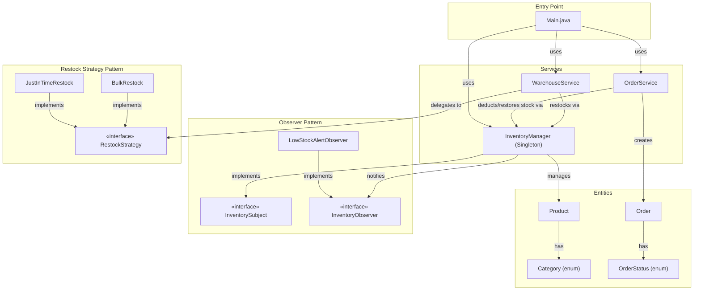
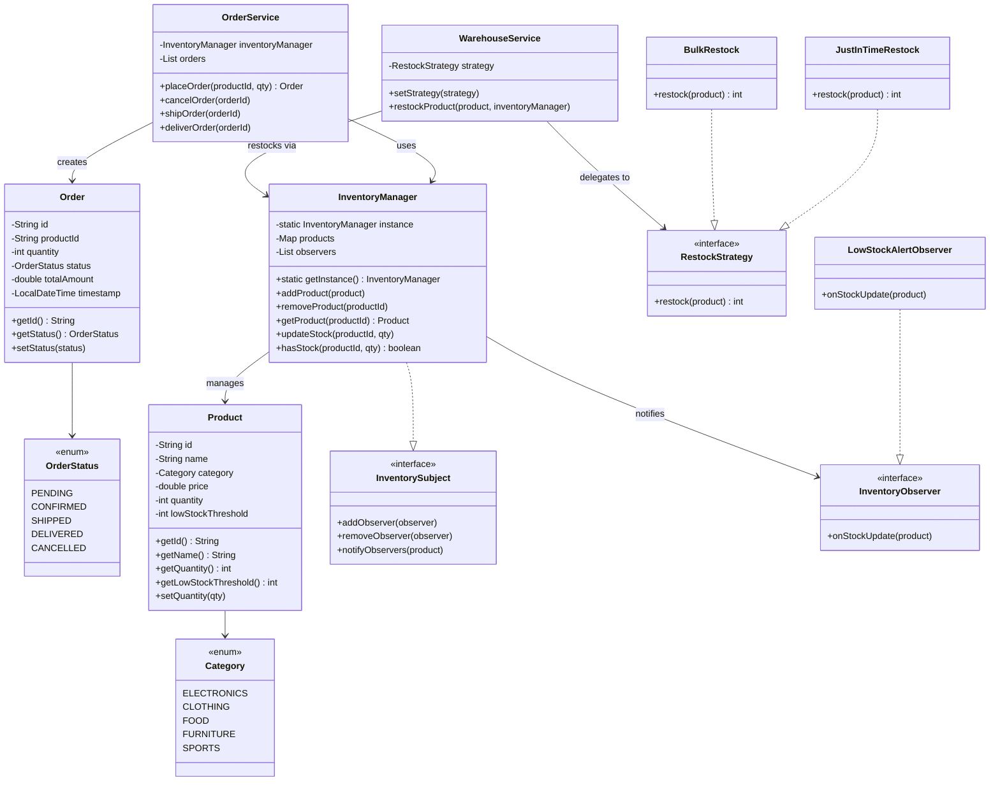
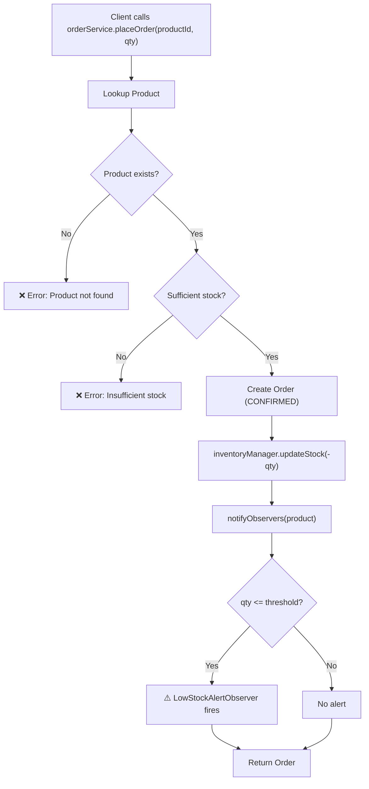
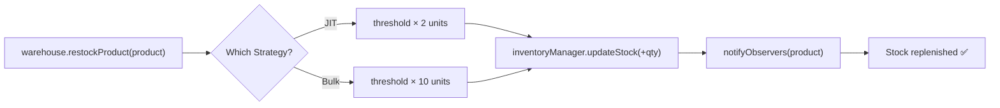
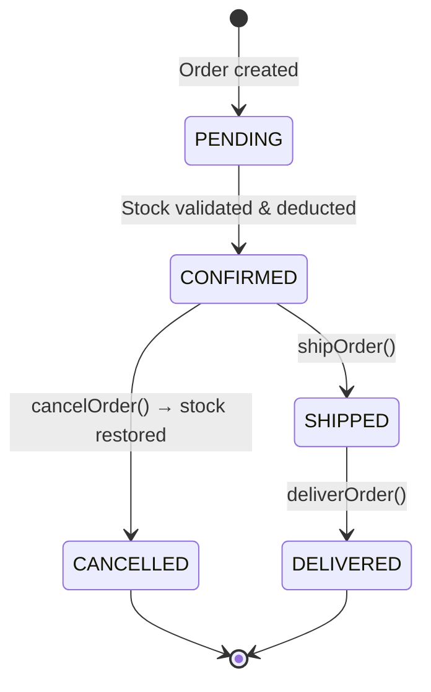

# 📦 Inventory Management System — Architecture

## Overview

A Java-based Inventory Management System built using **Observer**, **Strategy**, and **Singleton** design patterns. Supports product CRUD, order lifecycle management (place → ship → deliver / cancel), low-stock alert notifications, and pluggable restocking strategies.

---

## Block Diagram



---

## Design Patterns Used

| Pattern | Where | Why |
|---------|-------|-----|
| **Observer** | `InventorySubject` / `InventoryObserver` | `LowStockAlertObserver` auto-notifies when product stock drops below threshold |
| **Strategy** | `RestockStrategy` → `JustInTimeRestock`, `BulkRestock` | Pluggable restocking algorithms — easily switch between lean and bulk replenishment |
| **Singleton** | `InventoryManager` | Single global inventory ensures data consistency across all services |

---

## Class Diagram



---

## Order Flow



---

## Restock Flow



---

## Order Lifecycle



---

## Component Responsibilities

### Entities

| Class | Responsibility |
|-------|---------------|
| `Product` | Stores id, name, category, price, quantity, lowStockThreshold. Equals/hash by id |
| `Category` | Enum — ELECTRONICS, CLOTHING, FOOD, FURNITURE, SPORTS |
| `Order` | Immutable record of an order — productId, quantity, status, totalAmount, timestamp |
| `OrderStatus` | Enum — PENDING → CONFIRMED → SHIPPED → DELIVERED / CANCELLED |

### Observer

| Class | Responsibility |
|-------|---------------|
| `InventorySubject` | Interface — add/remove/notify observers |
| `InventoryObserver` | Interface — `onStockUpdate(product)` callback |
| `LowStockAlertObserver` | Prints alert when `product.quantity <= product.lowStockThreshold` |

### Strategy (Restock)

| Class | Responsibility |
|-------|---------------|
| `RestockStrategy` | Interface — `restock(product)` returns quantity to add |
| `JustInTimeRestock` | Lean restock — adds `threshold × 2` units |
| `BulkRestock` | Heavy restock — adds `threshold × 10` units |

### Services

| Class | Responsibility |
|-------|---------------|
| `InventoryManager` | Singleton — product CRUD, stock updates, observer notifications, thread-safe |
| `OrderService` | Order lifecycle — place, cancel, ship, deliver. Validates stock, deducts/restores on cancel |
| `WarehouseService` | Delegates restocking to pluggable `RestockStrategy`. Strategy switchable at runtime |

---

## Key Features

| Feature | Implementation |
|---------|---------------|
| **Product CRUD** | Add, remove, get, list, filter by category |
| **Order lifecycle** | PENDING → CONFIRMED → SHIPPED → DELIVERED / CANCELLED |
| **Low-stock alerts** | Observer pattern — auto-fires when stock drops below threshold |
| **Pluggable restock** | Strategy pattern — JIT (× 2) or Bulk (× 10), switchable at runtime |
| **Thread-safe** | `synchronized` stock updates in InventoryManager |
| **Stock validation** | Orders rejected if insufficient stock |
| **Cancel & restore** | Cancelling an order restores deducted stock |

---

## Folder Structure

```
Inventory Management System/
├── architecture.md
└── src/
    ├── Main.java                              (entry point + demo)
    ├── entities/
    │   ├── Category.java                      (enum)
    │   ├── Order.java
    │   ├── OrderStatus.java                   (enum)
    │   └── Product.java
    ├── Observer/
    │   ├── InventoryObserver.java             (interface)
    │   ├── InventorySubject.java              (interface)
    │   └── LowStockAlertObserver.java
    ├── Strategy/
    │   ├── BulkRestock.java
    │   ├── JustInTimeRestock.java
    │   └── RestockStrategy.java               (interface)
    └── Services/
        ├── InventoryManager.java              (Singleton + Subject)
        ├── OrderService.java
        └── WarehouseService.java
```
