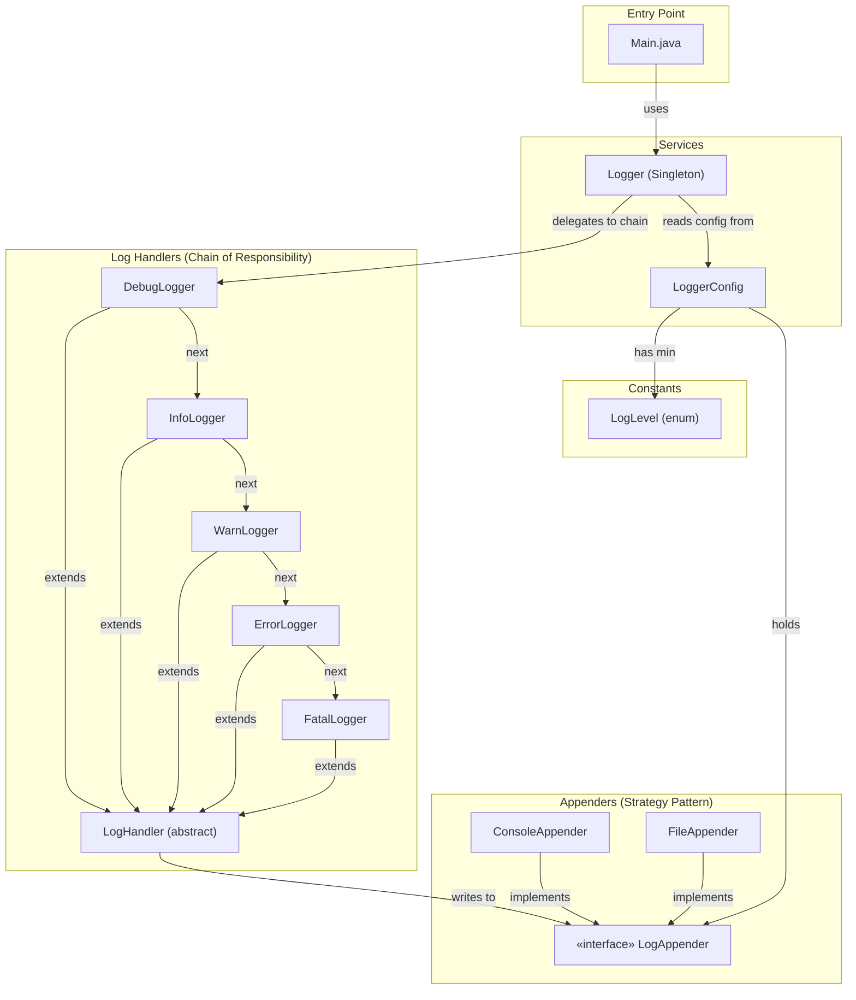
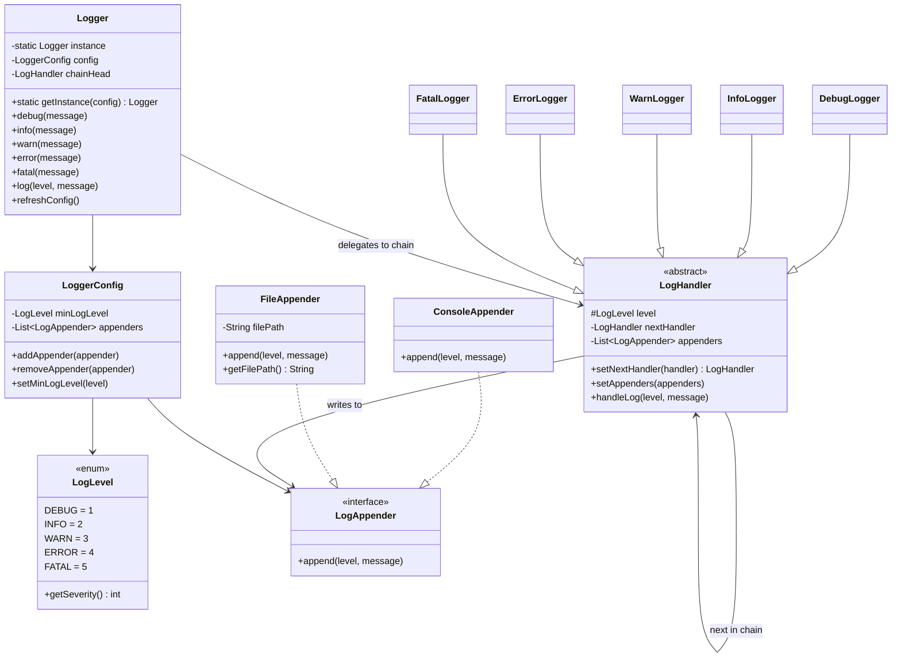
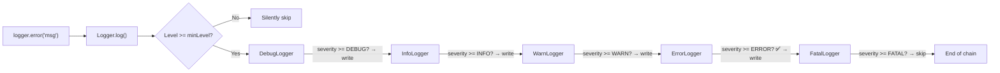
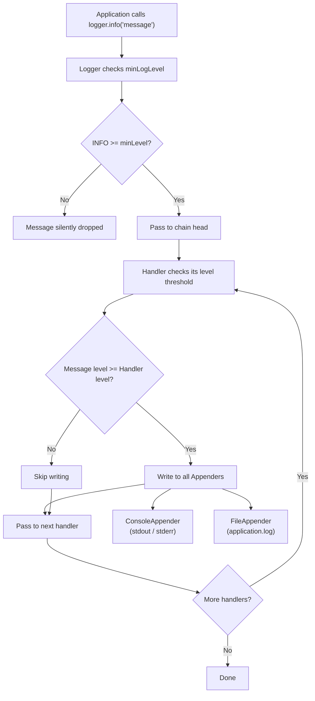

# 📝 Logging System — Architecture

## Overview

A Java-based Logging Framework built from scratch using **Chain of Responsibility**, **Strategy**, and **Singleton** design patterns. Supports multiple log levels, pluggable output destinations (console, file), dynamic level changes at runtime, and thread-safe logging.

---

## Block Diagram



---

## Design Patterns Used

| Pattern | Where | Why |
|---------|-------|-----|
| **Chain of Responsibility** | `LogHandler` → `DebugLogger` → `InfoLogger` → `WarnLogger` → `ErrorLogger` → `FatalLogger` | Each handler checks if the message meets its severity threshold, processes it, and passes to the next |
| **Strategy** | `LogAppender` → `ConsoleAppender`, `FileAppender` | Pluggable output destinations — easily add database, network, or custom appenders |
| **Singleton** | `Logger` | Single global logger instance ensures consistent logging across the application |

---

## Class Diagram



---

## Chain of Responsibility Flow



---

## Log Message Flow



---

## Component Responsibilities

### Constants

| Class | Responsibility |
|-------|---------------|
| `LogLevel` | Enum with severity ordering: DEBUG(1) < INFO(2) < WARN(3) < ERROR(4) < FATAL(5) |

### Appenders (Strategy)

| Class | Responsibility |
|-------|---------------|
| `LogAppender` | Interface — defines `append(level, message)` contract |
| `ConsoleAppender` | Writes to stdout (or stderr for ERROR/FATAL) with timestamp |
| `FileAppender` | Appends to a log file with timestamp formatting |

### Log Handlers (Chain of Responsibility)

| Class | Responsibility |
|-------|---------------|
| `LogHandler` | Abstract base — checks level threshold, writes to appenders, forwards to next handler |
| `DebugLogger` | Handles DEBUG+ messages |
| `InfoLogger` | Handles INFO+ messages |
| `WarnLogger` | Handles WARN+ messages |
| `ErrorLogger` | Handles ERROR+ messages |
| `FatalLogger` | Handles FATAL messages |

### Services

| Class | Responsibility |
|-------|---------------|
| `LoggerConfig` | Holds minimum log level and appender list. Supports runtime changes |
| `Logger` | Singleton facade — builds chain, filters by level, provides `debug/info/warn/error/fatal` convenience methods |

---

## Key Features

| Feature | Implementation |
|---------|---------------|
| **Multiple log levels** | DEBUG < INFO < WARN < ERROR < FATAL with severity filtering |
| **Pluggable appenders** | Strategy pattern — add Console, File, or custom appenders |
| **Dynamic level change** | Change `minLogLevel` at runtime via `LoggerConfig.setMinLogLevel()` + `Logger.refreshConfig()` |
| **Thread-safe** | All log methods are `synchronized` |
| **Timestamp formatting** | `yyyy-MM-dd HH:mm:ss` format in all appenders |
| **stderr for errors** | `ConsoleAppender` routes ERROR/FATAL to `System.err` |
| **Chain rebuilding** | Logger reconstructs handler chain on config change |

---

## Folder Structure

```
Logging System/
├── architecture.md
└── src/
    ├── Main.java                     (entry point + demo)
    ├── Appenders/
    │   ├── ConsoleAppender.java
    │   ├── FileAppender.java
    │   └── LogAppender.java          (interface)
    ├── Constants/
    │   └── LogLevel.java             (enum)
    ├── LogHandlers/
    │   ├── DebugLogger.java
    │   ├── ErrorLogger.java
    │   ├── FatalLogger.java
    │   ├── InfoLogger.java
    │   ├── LogHandler.java           (abstract — Chain of Responsibility)
    │   └── WarnLogger.java
    └── Services/
        ├── Logger.java               (Singleton)
        └── LoggerConfig.java
```
