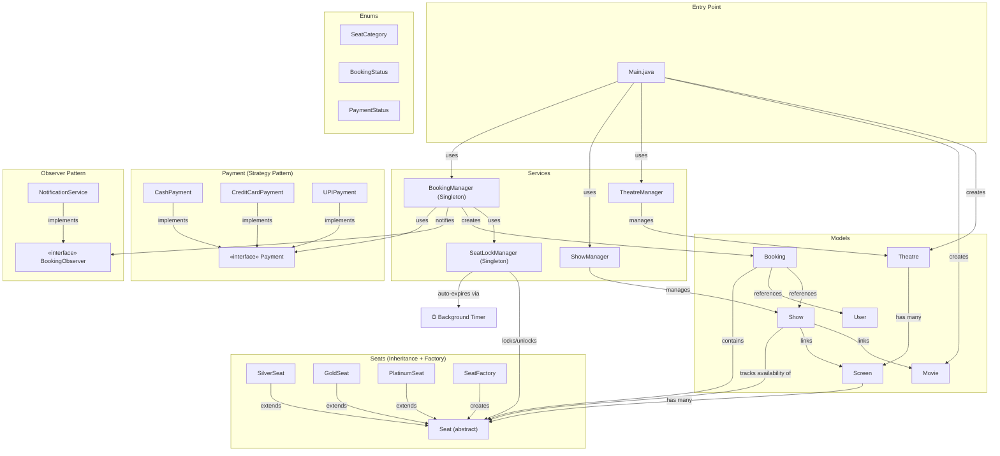
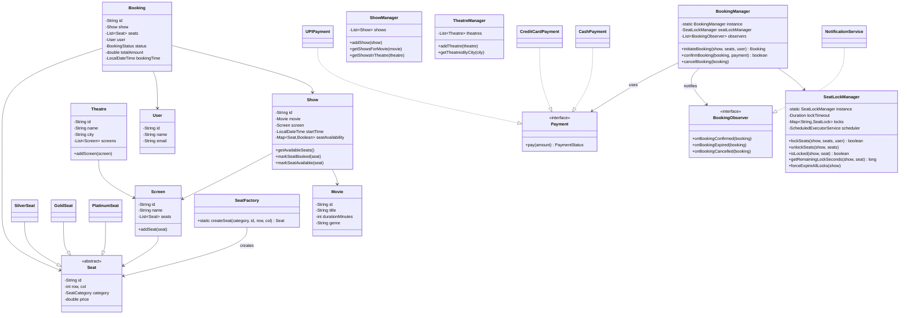
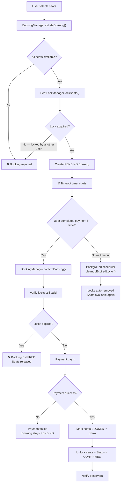
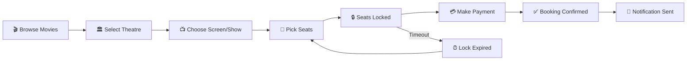

# 🎬 Movie Seat Booking System — Architecture

## Overview

A Java-based Movie Seat Booking System with **seat locking & timeout**, **multiple payment methods**, **multi-theatre/multi-screen** support, and **observer notifications**. Built using **Singleton**, **Strategy**, **Factory**, and **Observer** design patterns with thread-safe booking operations.

---

## Block Diagram



---

## Design Patterns Used

| Pattern | Where | Why |
|---------|-------|-----|
| **Singleton** | `BookingManager`, `SeatLockManager` | Single coordinator for bookings and locks across the system |
| **Strategy** | `Payment` → `CashPayment`, `CreditCardPayment`, `UPIPayment` | Pluggable payment methods without modifying booking logic |
| **Factory** | `SeatFactory` | Creates `SilverSeat`, `GoldSeat`, `PlatinumSeat` based on category enum |
| **Observer** | `BookingObserver` → `NotificationService` | Decoupled notifications on booking confirmed/expired/cancelled |
| **Inheritance** | `Seat` → `SilverSeat`, `GoldSeat`, `PlatinumSeat` | Each category has its own pricing with shared base behavior |

---

## Class Diagram



---

## Seat Locking & Timeout Flow



---

## Booking Flow



---

## Component Responsibilities

### Models

| Class | Responsibility |
|-------|---------------|
| `Movie` | Movie details: title, duration, genre |
| `User` | User identity: id, name, email |
| `Seat` _(abstract)_ | Base seat with position, category, price |
| `SilverSeat` / `GoldSeat` / `PlatinumSeat` | Category-specific seats with preset pricing ($150/$250/$400) |
| `Screen` | A hall with a collection of seats |
| `Theatre` | A cinema complex in a city with multiple screens |
| `Show` | A specific movie screening on a screen at a time, tracking per-seat availability |
| `Booking` | Links user + show + seats, tracks lifecycle status and total amount |

### Services

| Class | Responsibility |
|-------|---------------|
| `SeatLockManager` | **Thread-safe** seat locking with configurable timeout. Background scheduler auto-releases expired locks |
| `BookingManager` | Singleton orchestrator: initiate → confirm/expire → cancel. Notifies observers |
| `ShowManager` | Manages shows, query by movie or theatre |
| `TheatreManager` | Manages theatres, query by city |

### Payment (Strategy Pattern)

| Class | Description |
|-------|------------|
| `CashPayment` | Simulates cash payment |
| `CreditCardPayment` | Simulates card charge with masked number |
| `UPIPayment` | Simulates UPI transaction via UPI ID |

---

## Seat Pricing

| Category | Class | Price |
|----------|-------|-------|
| 🥈 Silver | `SilverSeat` | $150 |
| 🥇 Gold | `GoldSeat` | $250 |
| 💎 Platinum | `PlatinumSeat` | $400 |

---

## Folder Structure

```
Movie Booking System/
├── architecture.md
└── src/
    ├── Main.java                         (entry point + demo)
    ├── enums/
    │   ├── BookingStatus.java
    │   ├── PaymentStatus.java
    │   └── SeatCategory.java
    ├── factory/
    │   └── SeatFactory.java
    ├── models/
    │   ├── Booking.java
    │   ├── GoldSeat.java
    │   ├── Movie.java
    │   ├── PlatinumSeat.java
    │   ├── Screen.java
    │   ├── Seat.java                     (abstract)
    │   ├── Show.java
    │   ├── SilverSeat.java
    │   ├── Theatre.java
    │   └── User.java
    ├── observer/
    │   ├── BookingObserver.java           (interface)
    │   └── NotificationService.java
    ├── payment/
    │   ├── CashPayment.java
    │   ├── CreditCardPayment.java
    │   ├── Payment.java                  (interface)
    │   └── UPIPayment.java
    └── services/
        ├── BookingManager.java           (Singleton)
        ├── SeatLockManager.java          (Singleton + Timer)
        ├── ShowManager.java
        └── TheatreManager.java
```
