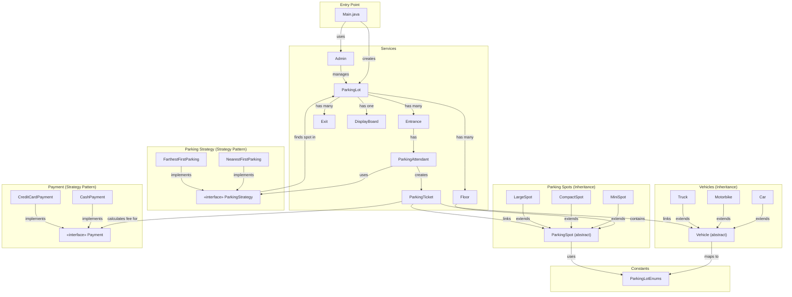
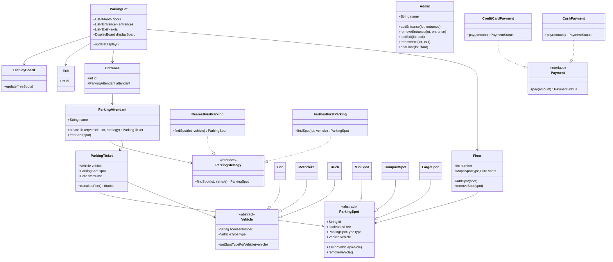
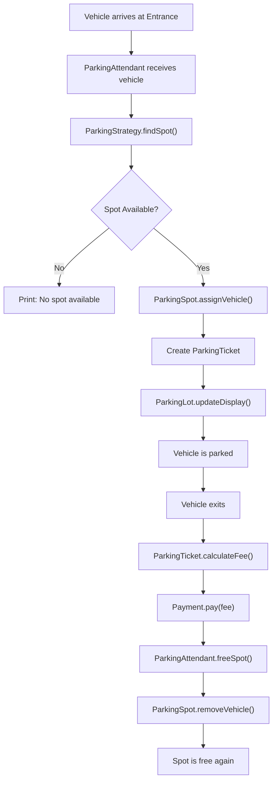
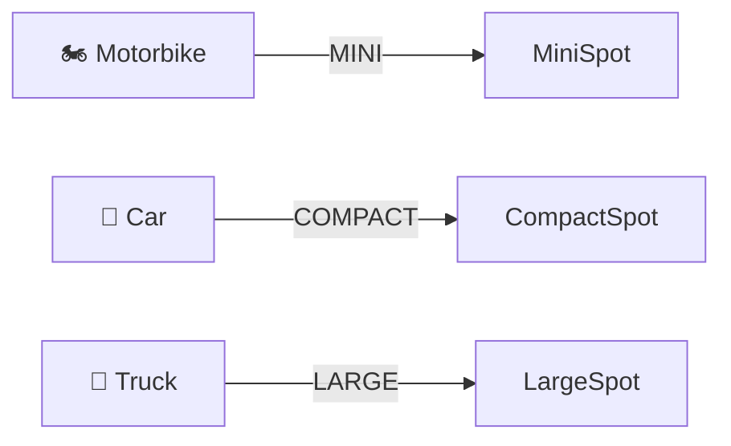

# 🅿️ Parking System — Architecture

## Overview

A Java-based multi-floor parking lot system supporting different vehicle types, pluggable parking strategies, multiple payment methods, and admin management. Uses **Strategy**, **Abstract Class Inheritance**, and clean separation of concerns.

---

## Block Diagram



---

## Design Patterns Used

| Pattern | Where | Why |
|---------|-------|-----|
| **Strategy** | `ParkingStrategy` → `NearestFirstParking`, `FarthestFirstParking` | Pluggable algorithms for spot selection |
| **Strategy** | `Payment` → `CashPayment`, `CreditCardPayment` | Flexible payment methods without modifying the core |
| **Inheritance** | `Vehicle` → `Car`, `Motorbike`, `Truck` | Type-specific vehicle behavior with shared base |
| **Inheritance** | `ParkingSpot` → `MiniSpot`, `CompactSpot`, `LargeSpot` | Type-specific spots with shared assign/remove logic |

---

## Class Diagram



---

## Component Responsibilities

### Core Services

| Class | Responsibility |
|-------|---------------|
| `ParkingLot` | Top-level container — holds floors, entrances, exits, display board |
| `Floor` | Holds a map of spot-type → list of parking spots |
| `Entrance` | Entry gate with an assigned `ParkingAttendant` |
| `Exit` | Exit gate identified by ID |
| `DisplayBoard` | Shows available spots count per type |
| `Admin` | Manages parking lot structure — adds/removes entrances, exits, floors |
| `ParkingAttendant` | Creates tickets using a `ParkingStrategy`, frees spots on exit |
| `ParkingTicket` | Links vehicle to spot, records start time, calculates time-based fee |

### Vehicle Hierarchy

| Class | Maps To |
|-------|---------|
| `Motorbike` | `MINI` spot |
| `Car` | `COMPACT` spot |
| `Truck` | `LARGE` spot |

### Spot Hierarchy

| Class | Type |
|-------|------|
| `MiniSpot` | For motorbikes |
| `CompactSpot` | For cars |
| `LargeSpot` | For trucks |

---

## Parking Flow



---

## Vehicle → Spot Type Mapping



---

## Enums Reference

| Enum | Values |
|------|--------|
| `ParkingSpotType` | `MINI`, `COMPACT`, `LARGE` |
| `VehicleType` | `MOTORBIKE`, `CAR`, `TRUCK` |
| `PaymentStatus` | `UNPAID`, `PAID`, `FAILED` |

---

## Folder Structure

```
Parking System/
└── src/
    ├── Main.java
    ├── Constants/
    │   └── ParkingLotEnums.java
    ├── ParkingSpots/
    │   ├── CompactSpot.java
    │   ├── LargeSpot.java
    │   ├── MiniSpot.java
    │   └── ParkingSpot.java       (abstract)
    ├── ParkingStrategy/
    │   ├── FarthestFirstParking.java
    │   ├── NearestFirstParking.java
    │   └── ParkingStrategy.java   (interface)
    ├── PaymentStatus/
    │   ├── CashPayment.java
    │   ├── CreditCardPayment.java
    │   └── Payment.java           (interface)
    ├── Services/
    │   ├── Admin.java
    │   ├── DisplayBoard.java
    │   ├── Entrance.java
    │   ├── Exit.java
    │   ├── Floor.java
    │   ├── ParkingAttendant.java
    │   ├── ParkingLot.java
    │   └── ParkingTicket.java
    └── Vehicles/
        ├── Car.java
        ├── Motorbike.java
        ├── Truck.java
        └── Vehicle.java           (abstract)
```
