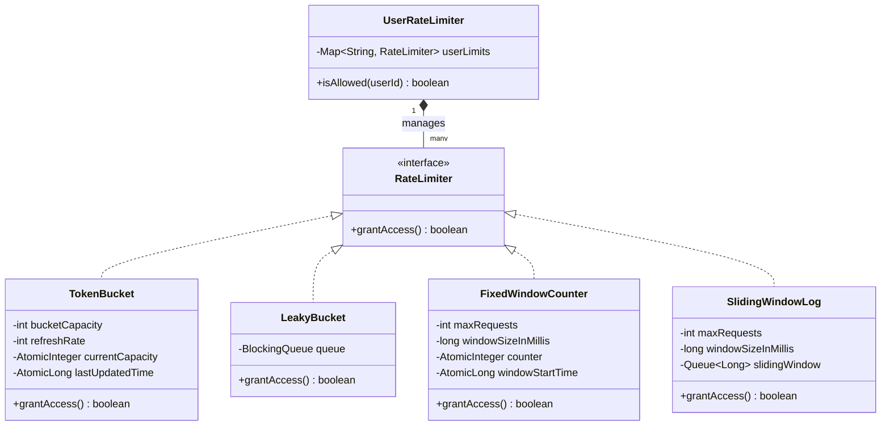

# Rate Limiter System Design Architecture

This module implements a Thread-Safe Rate Limiter leveraging the **Strategy Pattern**. It defines an overarching `RateLimiter` interface which allows dynamic switching between 4 industry-standard algorithms depending on exact system requirements, such as allowing burst traffic versus enforcing a strict uniform outflow.

## Block Diagram

