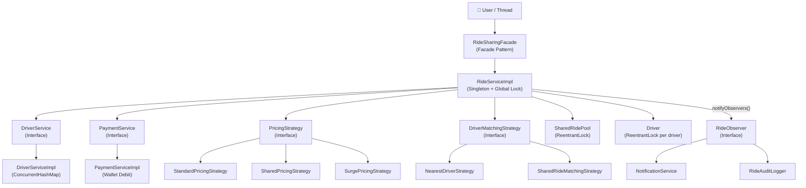
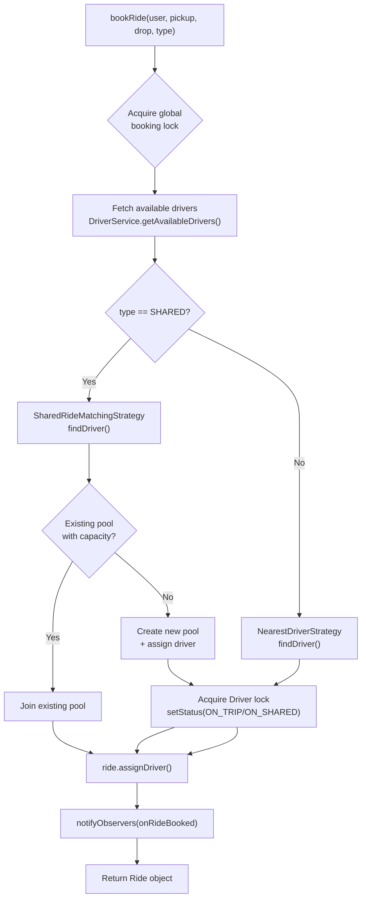
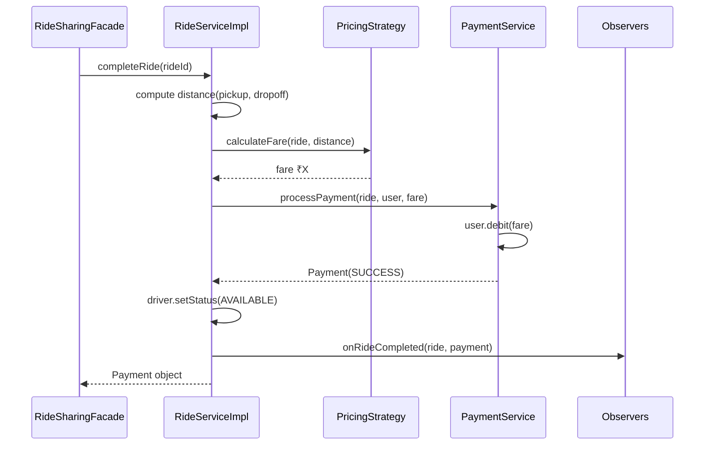
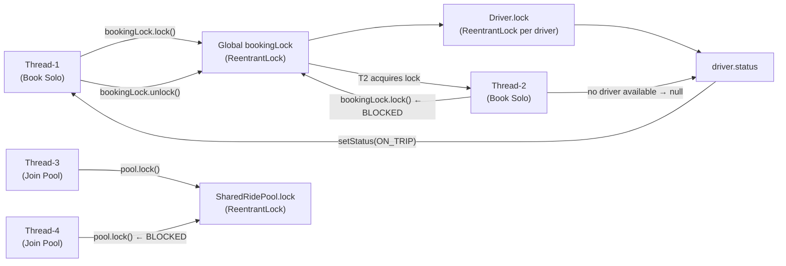
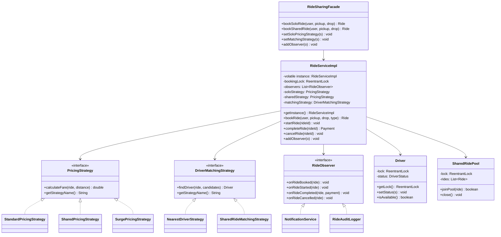

# Ride Sharing System — Architecture

## Overview

A **Low-Level Design (LLD)** of a Ride-Sharing platform (think Ola/Uber) implemented in Java. The system supports both **solo cab booking** and **shared ride pooling**, with pluggable pricing strategies (standard, shared, surge), nearest-driver matching, thread-safe concurrent booking, and a full Observer-based notification/audit trail.

Design principles applied: **SOLID**, **Single Source of Truth (Singleton)**, and five design patterns — **Strategy, Observer, Facade, Factory, and Thread-Safety via ReentrantLock**.

---

## Package Structure

```
src/
├── Main.java                                ← Demo entry point (6 scenarios)
├── enums/
│   ├── RideStatus.java                      ← REQUESTED, DRIVER_ASSIGNED, IN_PROGRESS, COMPLETED, CANCELLED
│   ├── DriverStatus.java                    ← AVAILABLE, ON_TRIP, ON_SHARED, OFFLINE
│   ├── RideType.java                        ← SOLO, SHARED
│   └── PaymentStatus.java                   ← PENDING, SUCCESS, FAILED, REFUNDED
├── model/
│   ├── Location.java                        ← Immutable lat/lng value object + distanceTo()
│   ├── User.java                            ← Rider data + wallet (debit/credit)
│   ├── Driver.java                          ← Driver + vehicle + status + ReentrantLock
│   ├── Ride.java                            ← Core aggregate: lifecycle transitions
│   ├── Payment.java                         ← Payment record (PENDING → SUCCESS/FAILED)
│   └── SharedRidePool.java                  ← Thread-safe pool; joinPool() with lock
├── strategy/
│   ├── PricingStrategy.java                 ← Interface: calculateFare(ride, distance)
│   ├── StandardPricingStrategy.java         ← ₹30 base + ₹12/km
│   ├── SharedPricingStrategy.java           ← 60% of standard (40% discount)
│   └── SurgePricingStrategy.java            ← standard × surge multiplier (≥1.0)
├── matching/
│   ├── DriverMatchingStrategy.java          ← Interface: findDriver(ride, candidates)
│   ├── NearestDriverStrategy.java           ← O(n) Euclidean distance scan
│   └── SharedRideMatchingStrategy.java      ← Prefers ON_SHARED drivers; fallback nearest
├── observer/
│   ├── RideObserver.java                    ← Interface: onBooked / onStarted / onCompleted / onCancelled
│   ├── NotificationService.java             ← Push/SMS/email notifications
│   └── RideAuditLogger.java                 ← Structured audit trail for compliance
├── service/
│   ├── DriverService.java                   ← Interface (DIP)
│   ├── DriverServiceImpl.java               ← ConcurrentHashMap driver registry
│   ├── PaymentService.java                  ← Interface (DIP)
│   ├── PaymentServiceImpl.java              ← Wallet-based charge + refund
│   └── RideServiceImpl.java                 ← Singleton; global booking lock + driver lock
└── facade/
    └── RideSharingFacade.java               ← Simplified API; hides all service wiring
```

---

## High-Level Block Diagram



---

## Ride Booking Flow



---

## Ride Completion Flow



---

## Locking Strategy



**Two-level locking:**
- **Global booking lock** — prevents two concurrent `bookRide()` calls from selecting the same driver
- **Driver-level lock** — guards atomic status transition (AVAILABLE → ON_TRIP/ON_SHARED)
- **SharedRidePool lock** — guards concurrent `joinPool()` calls on the same pool

---

## Class Diagram (Key Relationships)



---

## Design Patterns Summary

| Pattern | Where Used | Why |
|---|---|---|
| **Singleton** | `RideServiceImpl` | Single source of truth for all bookings; double-checked locking |
| **Strategy** | `PricingStrategy` | Swap Standard / Shared / Surge at runtime without changing RideService |
| **Strategy** | `DriverMatchingStrategy` | Swap Nearest / Shared matching algorithm without touching booking logic |
| **Observer** | `RideObserver`, `NotificationService`, `RideAuditLogger` | Decouple ride events from notification and audit logic |
| **Facade** | `RideSharingFacade` | Single clean API hiding wiring of services, observers, strategies |

---

## SOLID Principles

| Principle | Implementation |
|---|---|
| **S**ingle Responsibility | `User`=data; `RideServiceImpl`=booking logic; `PaymentServiceImpl`=payment; `Driver`=entity |
| **O**pen/Closed | Add new `PricingStrategy` or `RideObserver` without modifying `RideServiceImpl` |
| **L**iskov Substitution | `DriverServiceImpl` fully substitutes `DriverService`; any mock can replace it in tests |
| **I**nterface Segregation | `RideObserver`, `PricingStrategy`, `DriverMatchingStrategy`, `DriverService` are narrow, focused |
| **D**ependency Inversion | `RideServiceImpl` depends on `DriverService`, `PaymentService` interfaces — not on concretions |

---

## Concurrency Guarantees

| Scenario | Mechanism | Guarantee |
|---|---|---|
| Two users book the last driver simultaneously | Global `bookingLock` (ReentrantLock) | Only one booking proceeds; second sees no drivers |
| Status flip AVAILABLE → ON_TRIP | Driver-level `ReentrantLock` inside global lock | Atomic read-check-write; no race on status |
| Two users join a shared pool simultaneously | `SharedRidePool.lock` (ReentrantLock) | Atomic capacity check and add; no overbooking |
| Payment double-charge | User.debit() called inside completed ride (single thread) | One completion per ride; `activeRides.remove()` is ConcurrentHashMap atomic |
| Driver registry lookup | `ConcurrentHashMap` in `DriverServiceImpl` | Thread-safe read/write without external lock |
