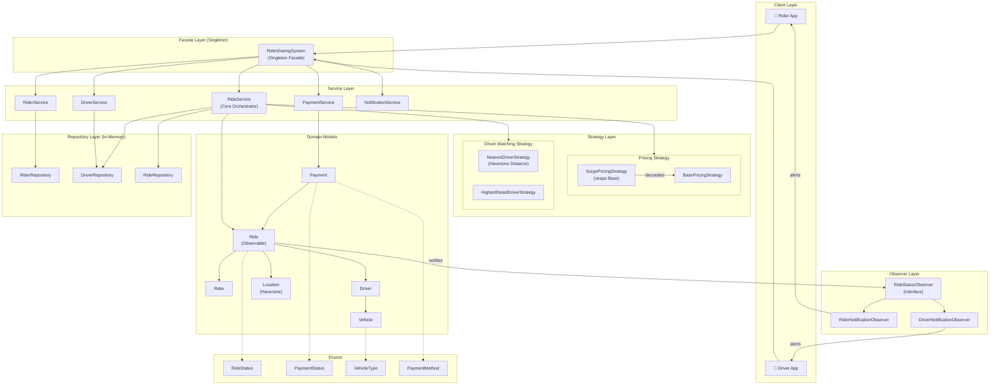
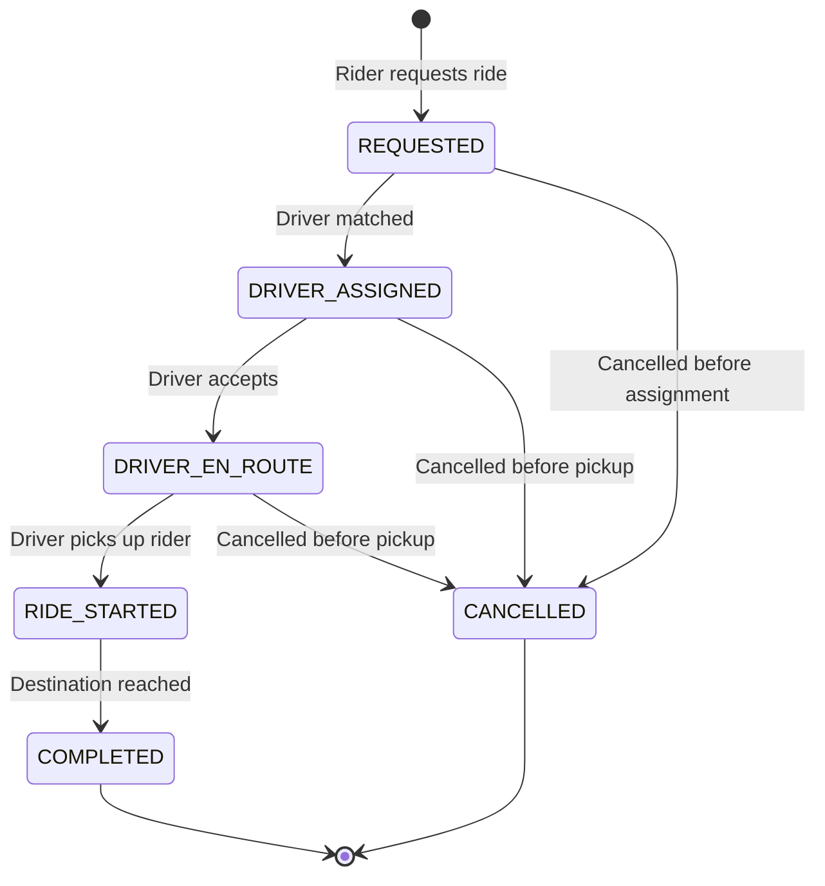
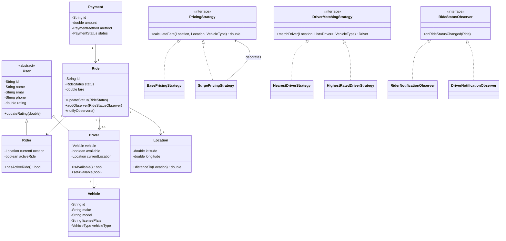
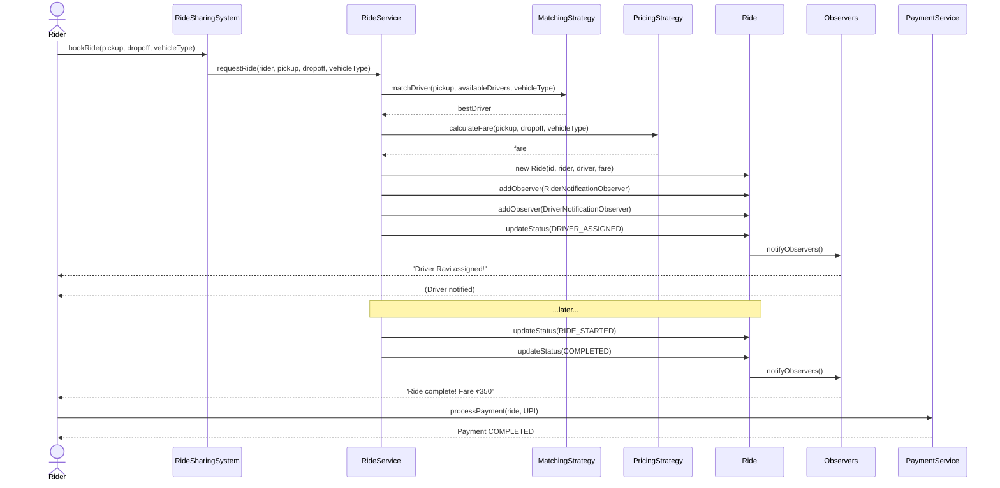

# Ride Sharing System — Architecture

## Overview

A production-style **Low-Level Design (LLD)** of an Uber/Ola-like platform built with Java. The system is modelled after standard system design interview expectations, covering complete ride lifecycle, driver matching, dynamic pricing, and real-time notifications.

---

## High-Level Block Diagram



---

## Ride Lifecycle State Machine



---

## Class Hierarchy



---

## Request Flow (Sequence)



---

## Design Patterns Used

| Pattern | Where Applied | Purpose |
|---|---|---|
| **Singleton** | `RideSharingSystem` | Single system-wide entry point; safe for concurrent access (double-checked locking) |
| **Facade** | `RideSharingSystem` | Hides service wiring complexity behind a clean API |
| **Strategy** | `PricingStrategy`, `DriverMatchingStrategy` | Swap pricing/matching algorithms at runtime without modifying core logic |
| **Decorator** | `SurgePricingStrategy` | Wraps `BasePricingStrategy` and applies a multiplier — open for extension |
| **Observer** | `Ride` → `RideStatusObserver` | Push-based notifications to rider and driver on every state change |
| **Repository** | `RiderRepository`, `DriverRepository`, `RideRepository` | Decouples business logic from data storage; swappable for a real DB |

---

## Package Structure

```
ridesharingSystem/
├── enums/
│   ├── RideStatus.java          # REQUESTED → COMPLETED/CANCELLED lifecycle
│   ├── PaymentStatus.java       # PENDING, COMPLETED, FAILED, REFUNDED
│   ├── VehicleType.java         # BIKE, AUTO, SEDAN, SUV
│   └── PaymentMethod.java       # CASH, CREDIT_CARD, UPI, WALLET
│
├── models/
│   ├── User.java                # Abstract base: name, email, running-average rating
│   ├── Rider.java               # Extends User + location + activeRide flag
│   ├── Driver.java              # Extends User + vehicle + availability + location
│   ├── Vehicle.java             # make, model, licensePlate, vehicleType
│   ├── Location.java            # lat/lon + Haversine distanceTo()
│   ├── Ride.java                # Core aggregate: state machine + Observable
│   └── Payment.java             # Transaction record per ride
│
├── strategy/
│   ├── PricingStrategy.java          # Interface
│   ├── BasePricingStrategy.java      # baseFare + ratePerKm × distance
│   ├── SurgePricingStrategy.java     # Decorator: base × surgeMultiplier
│   ├── DriverMatchingStrategy.java   # Interface
│   ├── NearestDriverStrategy.java    # Min Haversine distance
│   └── HighestRatedDriverStrategy.java # Max rating
│
├── observer/
│   ├── RideStatusObserver.java         # Interface
│   ├── RiderNotificationObserver.java  # Notifies rider on each status change
│   └── DriverNotificationObserver.java # Notifies driver on each status change
│
├── repository/
│   ├── RiderRepository.java    # In-memory HashMap store
│   ├── DriverRepository.java   # + findAvailableDrivers()
│   └── RideRepository.java     # + findByRiderId / driverId / status
│
├── service/
│   ├── RideService.java         # Core orchestrator: match + fare + state machine
│   ├── DriverService.java       # Registration, location, availability, ratings
│   ├── RiderService.java        # Registration, retrieval, ratings
│   ├── PaymentService.java      # processPayment, refund, gateway simulation
│   └── NotificationService.java # SMS, email, receipts
│
├── RideSharingSystem.java       # Singleton Facade — wires everything
└── Main.java                    # Demo: full lifecycle, surge, cancel, no-driver
```

---

## Key Design Decisions (Interview Discussion Points)

### 1. Why Strategy for Pricing and Matching?
Both algorithms need to be **swappable at runtime** (e.g., enable surge pricing during peak hours, or switch to quality-first matching for premium rides) without changing `RideService`. The Strategy pattern enables open/closed principle compliance.

### 2. Why Observer for Notifications?
Ride status changes must propagate to **multiple parties** (rider, driver, billing) without `Ride` needing to know who's listening. New notification channels (e.g., SMS gateway, analytics) can be added without touching `Ride` or `RideService`.

### 3. Why Decorator for Surge Pricing?
`SurgePricingStrategy` wraps any `PricingStrategy`, so surge logic is **isolated** and doesn't duplicate base fare rules. This makes it composable (e.g., wrap surge on top of a special event pricing strategy).

### 4. Why Repository Pattern?
Decouples business services from storage. In production, swap `HashMap` stores with JPA/Hibernate repositories without touching service code.

### 5. Thread Safety Consideration
`RideSharingSystem` uses **double-checked locking** for thread-safe singleton initialization. In production, driver availability updates would be in a distributed lock or DB transaction to prevent double-booking.

---

## Scalability Notes (For System Design Discussion)

| Concern | Production Solution |
|---|---|
| Driver location updates | Write to Redis Geo (O(log n) radius queries) |
| Driver matching | Use PostGIS or Elasticsearch geo-nearest queries |
| Ride state machine | Distribute across services; use Kafka events for state transitions |
| Surge pricing | ML model or real-time demand/supply ratio from metrics |
| Notifications | Firebase FCM (mobile push), Twilio (SMS), SendGrid (email) |
| Payments | Stripe/Razorpay SDK integration |
| Scalability | Microservices: Ride Service, Driver Service, Payment Service, Notification Service |
