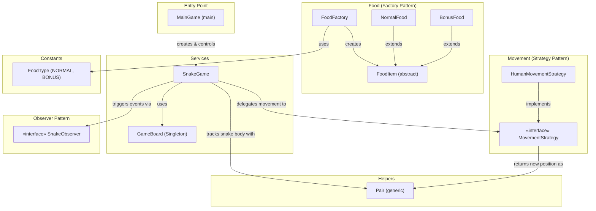
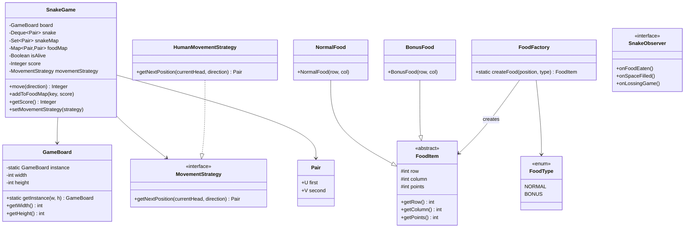
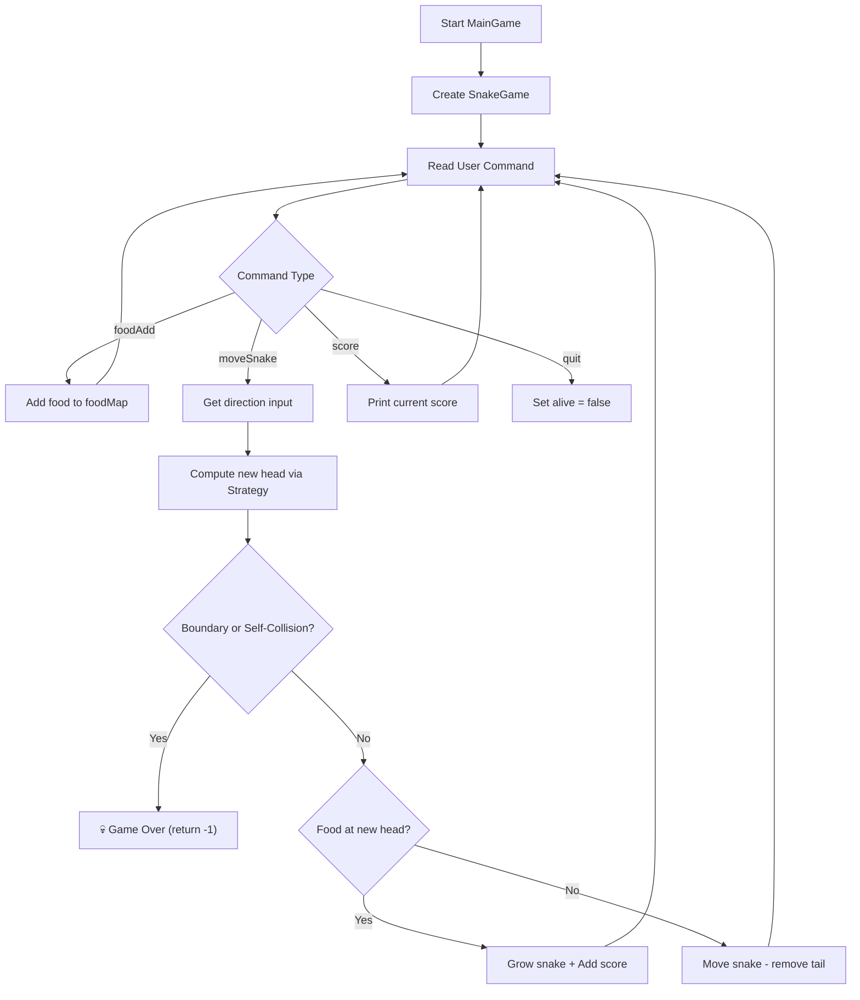

# 🐍 Snake Game — Architecture

## Overview

A console-based Snake Game built in Java using **Singleton**, **Strategy**, **Factory**, and **Observer** design patterns. Features a grid-based game board, food spawning with bonus mechanics, and pluggable movement strategies.

---

## Block Diagram



---

## Design Patterns Used

| Pattern | Where | Why |
|---------|-------|-----|
| **Singleton** | `GameBoard` | Only one game board should exist per game session |
| **Strategy** | `MovementStrategy` → `HumanMovementStrategy` | Makes movement logic pluggable (human, AI, etc.) |
| **Factory** | `FoodFactory` | Creates `NormalFood` or `BonusFood` based on type string |
| **Observer** | `SnakeObserver` | Notifies listeners on game events (food eaten, game over, board full) |

---

## Class Diagram



---

## Component Responsibilities

### `MainGame`
- Entry point — reads user commands (`foodAdd`, `moveSnake`, `score`, `quit`)
- Creates `SnakeGame` and drives the game loop via stdin commands

### `SnakeGame`
- Core game logic — maintains snake body (Deque), tracks alive/dead state & score
- Handles movement, boundary checks, self-collision, and food consumption
- Delegates next-position calculation to `MovementStrategy`

### `GameBoard` (Singleton)
- Represents the grid dimensions (width × height)
- Single instance ensures consistent board across the game

### Food System
| Class | Responsibility |
|-------|---------------|
| `FoodItem` _(abstract)_ | Base class with position (row, col) and points |
| `NormalFood` | Standard food — 1 point |
| `BonusFood` | Bonus food — 3 points |
| `FoodFactory` | Creates food by type string using `FoodType` enum |

### `MovementStrategy` (Interface)
- Defines `getNextPosition()` contract
- `HumanMovementStrategy` — computes new head position based on direction input

### `SnakeObserver` (Interface)
- Event hooks: `onFoodEaten()`, `onSpaceFilled()`, `onLossingGame()`

---

## Game Flow



---

## Folder Structure

```
Snake Game/
└── src/
    ├── Main.java
    ├── Constants/
    │   └── FoodType.java          (enum)
    ├── Food/
    │   ├── BonusFood.java
    │   ├── FoodFactory.java       (factory)
    │   ├── FoodItem.java          (abstract)
    │   └── NormalFood.java
    ├── Helpers/
    │   └── Pair.java              (generic utility)
    ├── MovementStrategy/
    │   ├── HumanMovementStrategy.java
    │   └── MovementStrategy.java  (interface)
    ├── Observers/
    │   └── SnakeObserver.java     (interface)
    └── Services/
        ├── GameBoard.java         (Singleton)
        ├── MainGame.java          (entry point)
        └── SnakeGame.java
```
