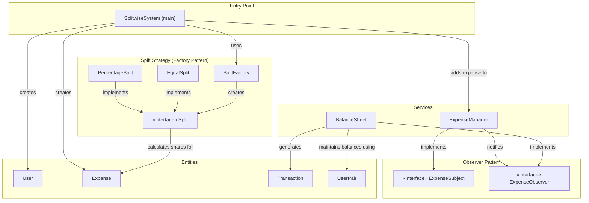
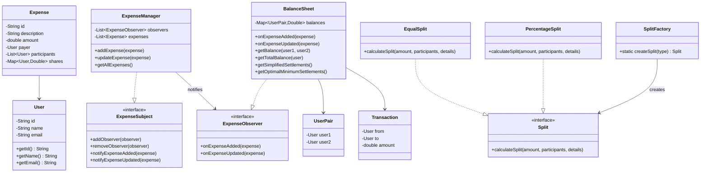
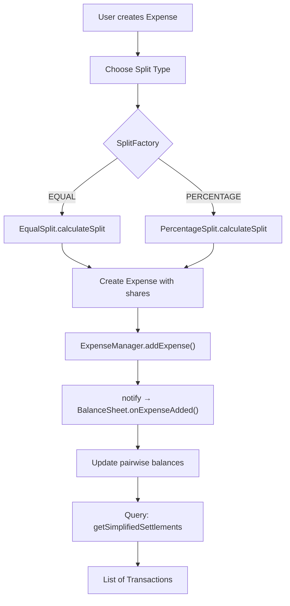

# 💰 Splitwise System — Architecture

## Overview

A Java-based expense-splitting system that lets users share expenses with **equal** or **percentage-based** splits. Features an **Observer pattern** to auto-update balances, a **Factory pattern** for split creation, and **DP-based optimal settlement** calculation.

---

## Block Diagram



---

## Design Patterns Used

| Pattern | Where | Why |
|---------|-------|-----|
| **Observer** | `ExpenseSubject` / `ExpenseObserver` | `BalanceSheet` auto-updates when expenses are added/modified via `ExpenseManager` |
| **Factory** | `SplitFactory` | Creates `EqualSplit` or `PercentageSplit` based on a string type — avoids hardcoded `if/else` in client code |

---

## Class Diagram



---

## Component Responsibilities

### Entities

| Class | Responsibility |
|-------|---------------|
| `User` | Stores user id, name, email. Overrides `equals` & `hashCode` by id |
| `Expense` | Immutable record of an expense — payer, participants, and per-user shares |
| `Transaction` | Represents a "from → to" settlement with amount |
| `UserPair` | Key for the balance map — tracks balance between two users |

### Services

| Class | Responsibility |
|-------|---------------|
| `ExpenseManager` | Stores expenses, implements `ExpenseSubject` to notify observers on add/update |
| `BalanceSheet` | Observes expenses, maintains pairwise balances, computes simplified & optimal settlements |

### Split Strategies

| Class | Responsibility |
|-------|---------------|
| `SplitFactory` | Factory method — creates `EqualSplit` or `PercentageSplit` by type string |
| `EqualSplit` | Divides amount equally among all participants |
| `PercentageSplit` | Splits amount based on user-specified percentages |

---

## Expense Flow



---

## Settlement Algorithms

| Algorithm | Method | Complexity | Approach |
|-----------|--------|------------|----------|
| **Greedy** | `getSimplifiedSettlements()` | O(n²) | Match max creditor with max debtor iteratively |
| **Backtracking** | `getSubOptimalMinimumSettlements()` | Exponential | DFS trying all settlement combinations |
| **DP Bitmask** | `getOptimalMinimumSettlements()` | O(3ⁿ) | Finds max balanced subgroups using bitmask DP |

---

## Folder Structure

```
Splitwise System/
└── src/
    ├── Main.java
    ├── entities/
    │   ├── Expense.java
    │   ├── Transaction.java
    │   ├── User.java
    │   └── UserPair.java
    ├── Observer/
    │   ├── ExpenseObserver.java    (interface)
    │   └── ExpenseSubject.java     (interface)
    ├── Services/
    │   ├── BalanceSheet.java       (observer)
    │   ├── ExpenseManager.java     (subject)
    │   └── SplitwiseSystem.java    (entry point)
    └── splitWays/
        ├── EqualSplit.java
        ├── PercentageSplit.java
        ├── Split.java              (interface)
        └── SplitFactory.java       (factory)
```
