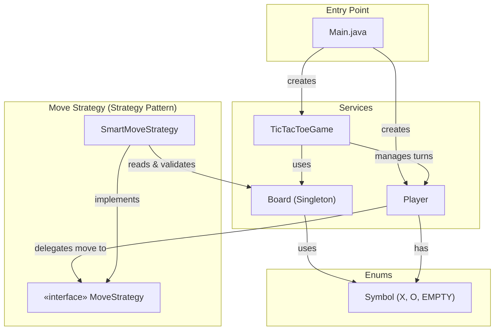
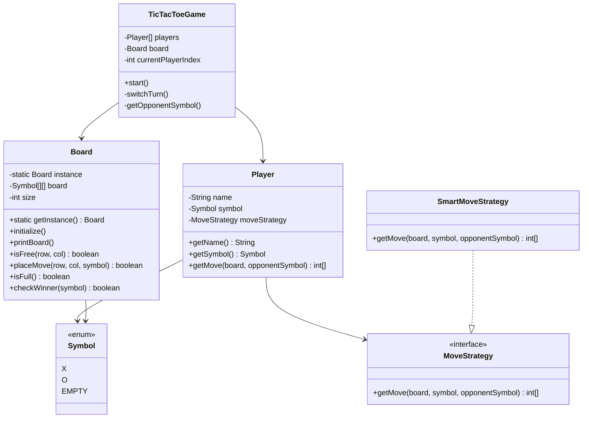
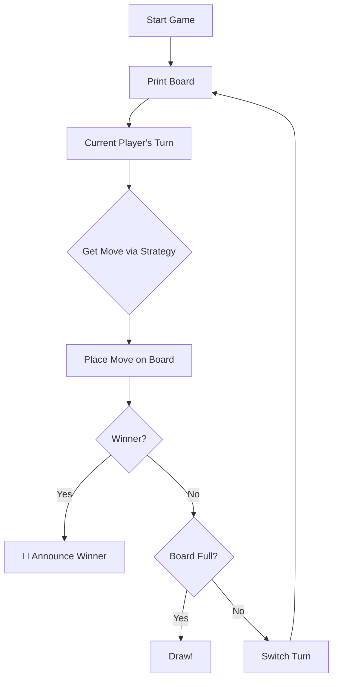

# 🎮 Tic Tac Toe — Architecture

## Overview

A console-based Tic Tac Toe game built in Java using **Singleton** and **Strategy** design patterns. Supports human vs. smart AI player with a pluggable move strategy.

---

## Block Diagram



---

## Design Patterns Used

| Pattern | Where | Why |
|---------|-------|-----|
| **Singleton** | `Board` | Only one board instance exists throughout the game |
| **Strategy** | `MoveStrategy` → `SmartMoveStrategy` | Allows swapping between different AI/move strategies without changing `Player` |

---

## Class Diagram



---

## Component Responsibilities

### `TicTacToeGame`
- Orchestrates the game loop (turn-by-turn play)
- Checks for win/draw conditions after each move
- Switches turns between players

### `Board` (Singleton)
- Maintains the 3×3 grid state
- Validates free cells, places moves, checks for winner
- Prints the current board to the console

### `Player`
- Holds player name, symbol, and a `MoveStrategy`
- Delegates move computation to the strategy

### `MoveStrategy` (Interface)
- Defines `getMove()` contract for all move strategies

### `SmartMoveStrategy`
- Implements a priority-based AI:
  1. **Try to win** — checks if any move leads to a win
  2. **Block opponent** — prevents opponent from winning
  3. **Fallback** — picks the first available cell

---

## Game Flow



---

## Folder Structure

```
Tic Tac Toe/
└── src/
    ├── Main.java
    ├── Enums/
    │   └── Symbol.java
    ├── MoveStrategy/
    │   ├── MoveStrategy.java        (interface)
    │   └── SmartMoveStrategy.java
    └── Services/
        ├── Board.java               (Singleton)
        ├── Player.java
        └── TicTacToeGame.java
```
